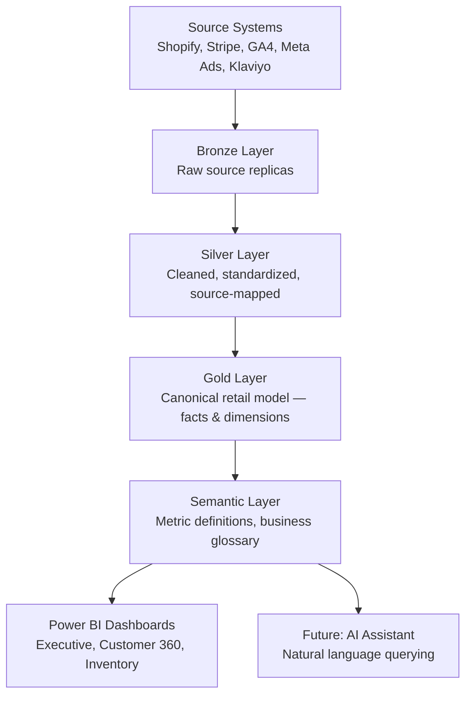

# Section 1: Executive Overview

> **Document status:** Draft v1
> **Audience:** Spark Analytics internal team, prospective clients, partners
> **Purpose:** Frame what the Spark Retail Pack is, who it serves, and what it delivers

---

## 1.1 What is the Spark Retail Pack?

The **Spark Retail Pack** is a productized data warehouse accelerator for retail and e-commerce companies. It is not a SaaS product, not a managed service, and not a consulting deliverable in the traditional sense. It is a **reusable platform** — a combination of pre-built data models, transformations, semantic definitions, dashboards, and governance artifacts — that allows a retail company to stand up a fully functional, AI-ready analytics warehouse in **4–6 weeks** rather than the **6–12 months** a custom build typically requires.

It is built on a modern, vendor-neutral stack (Snowflake, dbt, Power BI) and distributed as a hybrid open-source / proprietary package. The open-source core lives on GitHub and is freely usable; the proprietary modules and implementation services are commercial offerings from Spark Analytics.

The pack is designed to be **adopted, not just installed**. Clients can configure source mappings to their existing systems (Shopify, Stripe, etc.) without modifying the canonical model. They get standardized, trustworthy KPIs out of the box, while retaining the ability to extend the model with their own business logic.

---

## 1.2 The problem it solves

Mid-market retail and e-commerce companies face a recurring pattern:

- They have data in 8–15 different SaaS tools (storefront, payments, ads, email, fulfillment, support).
- They have grown past the point where spreadsheets and platform-native dashboards are enough.
- They cannot afford a 6-person internal data team, but they need executive reporting, customer analytics, and inventory visibility yesterday.
- They are quoted **$200K–$500K** and **6+ months** by traditional data consultancies to build "a custom warehouse."
- The result is often a half-finished project, stale dashboards, and a team that doesn't trust the numbers.

The Spark Retail Pack collapses this timeline and cost by **pre-building 70% of what every retail company needs** and only customizing the remaining 30%. Clients get to a production-grade warehouse faster, at a fraction of the cost, with metric definitions consistent across the industry.

---

## 1.3 Target client profile

The pack is purpose-built for a specific segment. Trying to serve everyone weakens the product for the buyers who actually need it.

**Primary target:**

| Dimension | Profile |
|---|---|
| Industry | Direct-to-consumer (D2C) retail and e-commerce |
| Revenue (GMV) | $5M – $200M annually |
| Channels | Online-first, may have small physical retail or marketplace presence |
| Tech stack | Shopify, WooCommerce, or Magento (not SAP, not Oracle Retail) |
| Team size | 50 – 1,000 employees |
| Data maturity | Outgrown platform dashboards; no dedicated data team or a team of 1–3 |
| Geography | English-speaking markets initially (US, UK, Canada, Australia, East Africa) |

**Not the target:**

- Large enterprise retailers running SAP or Oracle Retail (different connectors, different complexity)
- Pure marketplaces (Amazon, eBay) — they need different fact tables
- B2B distributors — different sales process and metrics
- Very early-stage e-commerce (<$5M GMV) — platform dashboards still sufficient

Picking this segment narrowly is deliberate. It lets us optimize the connector list, KPI definitions, and dashboard designs for the buyer we are actually selling to.

---

## 1.4 What the pack delivers

A client who adopts the Spark Retail Pack v1 receives:

**Data foundation**

- A fully modeled Snowflake warehouse with bronze, silver, and gold layers
- Pre-built integrations with 5 core systems (Shopify, Stripe, Google Analytics 4, Meta Ads, Klaviyo)
- A canonical retail data model — customers, products, orders, inventory, sessions, marketing spend
- Slowly-changing dimension handling, idempotent loads, incremental processing

**Analytical layer**

- A library of ~25 standardized retail KPIs (GMV, AOV, LTV, CAC, repeat purchase rate, inventory turnover, etc.)
- A semantic layer with consistent metric definitions across all reporting tools
- A business glossary defining every metric and dimension in plain language

**Visualization**

- Three Power BI dashboard packs: Executive Summary, Customer 360, Inventory Health
- Pre-built drill-through patterns, filters, and bookmarks
- A starter set of role-based access patterns

**Operations**

- Basic governance: data ownership tagging, PII classification, lineage scaffolding
- Documentation auto-generated from the dbt project
- A synthetic demo dataset with realistic business scenarios for testing and training

**Implementation support**

- Client-side configuration templates for source mapping
- Onboarding playbook
- Optional Spark Analytics implementation services

---

## 1.5 Scope of v1 (MVP)

**In scope for v1:**

- 5 source connectors: Shopify, Stripe, Google Analytics 4, Meta Ads, Klaviyo
- 3 analytical modules: Sales Analytics, Customer 360, Inventory Health
- 25 standardized KPIs (full catalog in Section 5)
- 3 Power BI dashboard packs
- Snowflake as the only supported warehouse
- dbt Core as the only supported transformation framework
- Open-source distribution of the core; proprietary distribution of advanced modules
- Synthetic demo dataset (1 retail company, 12 months of activity)
- English-language documentation and dashboards

**Deliberately out of scope for v1 (planned for v2+):**

- Marketing attribution modeling (multi-touch, MMM)
- LTV cohort analysis with predictive scoring
- AI-powered natural language querying
- Embedded analytics framework
- Additional connectors beyond the 5 listed
- Power BI alternatives (Looker, Metabase, Tableau templates)
- Multi-warehouse support (BigQuery, Databricks)
- Full IaC deployment automation
- Real-time / streaming pipelines
- Non-English localization

**Why this scope:** v1 must be small enough to ship in 3 months and large enough to demo a credible end-to-end story. Everything above the line achieves that; anything below it can wait.

---

## 1.6 High-level architecture summary

The pack follows a layered architecture, with each layer owned by a different concern:

Full architectural detail, including dbt project structure, Snowflake setup, and security model, is in **Section 2: Architecture**.

---

## 1.7 Business model and distribution

The pack is distributed as a **hybrid open-core product**:

| Component | Distribution | Pricing |
|---|---|---|
| Core canonical model, staging models, 15 base KPIs | Open source (MIT license, GitHub) | Free |
| Advanced KPI modules, semantic layer extensions, AI metadata | Proprietary dbt package | Annual license |
| Power BI dashboard packs | Proprietary `.pbix` files | Included with proprietary license |
| Implementation, customization, training | Spark Analytics consultancy services | Project-based |
| Ongoing managed service (future) | Spark Analytics managed offering | Monthly subscription |

The strategic rationale for this model is detailed in **Section 11: Open-Source vs. Pro Split**, but the short version is: the open-source core is the marketing engine, the proprietary modules are the upsell path, and the services wrap is the primary revenue stream while the product matures.

---

## 1.8 Success criteria

The v1 release is considered successful when:

1. **A client can be onboarded in 4 weeks** from kickoff to first dashboard, given clean source data.
2. **All 25 KPIs are computed consistently** between dbt models, the semantic layer, and Power BI.
3. **The demo dataset tells a coherent story** that a sales prospect can follow without explanation.
4. **The open-source repo has documented installation** that a competent analytics engineer can follow without Spark support.
5. **Three reference clients** have adopted the pack and validated the model against their real data.
6. **Spark Analytics can credibly sell a $50K–$150K implementation engagement** anchored on the pack.

---

## 1.9 What this document is not

This design document is not:

- A user manual (that will live in the open-source repo)
- A sales deck (that's a separate artifact derived from this)
- A contract or commitment to specific delivery dates
- Immutable — sections will be revised as the build surfaces new requirements

It **is** the single source of truth for what we're building, why, and how the pieces fit together. Every disagreement about scope or design should be resolved by updating this document.

---

**Next:** [Section 2: Architecture](./02_architecture.md) — the technical foundation.
