# Section 2: Architecture

> **Document status:** Draft v1
> **Audience:** Engineering team, technical clients, partners
> **Purpose:** Define the technical foundation of the Spark Retail Pack — layers, tech stack, project structure, data flow, and operational concerns

---

## 2.1 Architectural principles

Before describing layers and components, the pack is built on five principles. Every design decision should be traceable back to one of them.

1. **The warehouse models the business, not source systems.** A `customer` in the canonical model is a customer regardless of whether they originated in Shopify, Stripe, or Klaviyo. Source-system quirks live in the silver layer and never propagate upward.
2. **Customization happens at the edges, not the core.** Clients map their sources into the silver layer via configuration. The gold layer is canonical and stable. This is what makes the pack reusable across clients.
3. **Metrics are defined once and consumed everywhere.** The semantic layer is the only place a KPI formula is written. dbt models, Power BI dashboards, and future AI assistants all consume the same definition. There is no "Power BI version" of revenue.
4. **Everything is code, everything is versioned.** Models, tests, documentation, dashboards, governance rules, and infrastructure are all version-controlled artifacts. No "click-ops" configuration that lives only in someone's browser.
5. **The pack is opinionated, not prescriptive.** We make strong default choices (Snowflake, dbt, Power BI) so clients don't have to. But every layer has documented extension points for clients who need to deviate.

---

## 2.2 Layered architecture

The pack uses a five-layer architecture. Each layer has a clear contract with the layers above and below it.

```mermaid
flowchart TD
    subgraph Sources["Source Systems"]
        S1[Shopify]
        S2[Stripe]
        S3[Google Analytics 4]
        S4[Meta Ads]
        S5[Klaviyo]
    end

    subgraph Bronze["Bronze Layer — Raw"]
        B1[Source schema replicas<br/>1:1 with source<br/>No transformation]
    end

    subgraph Silver["Silver Layer — Standardized"]
        SL1[Cleaned & typed]
        SL2[Source-mapped to canonical names]
        SL3[One staging model per source table]
    end

    subgraph Gold["Gold Layer — Canonical"]
        G1[dim_customer, dim_product, dim_date...]
        G2[fact_orders, fact_inventory, fact_sessions...]
        G3[Industry-standard model<br/>Source-agnostic]
    end

    subgraph Marts["Marts Layer"]
        M1[Sales Analytics Mart]
        M2[Customer 360 Mart]
        M3[Inventory Health Mart]
    end

    subgraph Semantic["Semantic Layer"]
        SEM1[Metric definitions]
        SEM2[Business glossary]
        SEM3[Entity relationships]
    end

    subgraph Consumption["Consumption"]
        C1[Power BI Dashboards]
        C2[Future: AI Assistant]
        C3[Future: Embedded analytics]
    end

    Sources --> Bronze
    Bronze --> Silver
    Silver --> Gold
    Gold --> Marts
    Marts --> Semantic
    Semantic --> Consumption
```



### Layer-by-layer responsibilities

**Bronze (Raw)**

- Receives data from ingestion tools (Fivetran, Airbyte, or custom loaders) into Snowflake.
- Tables are 1:1 replicas of source schemas. Field names, types, and structures match the source.
- No business logic, no joins, no renaming.
- Schema: `RAW_<source>` (e.g., `RAW_SHOPIFY`, `RAW_STRIPE`).
- This layer exists for replay, audit, and debugging. It is the system of record for "what the source told us."

**Silver (Staging)**

- One staging model (`stg_<source>__<entity>`) per bronze table.
- Cleans up types, casts strings to dates, fixes obvious data quality issues.
- Renames columns to canonical names defined in configuration.
- Filters out test data, soft-deleted records, and known junk.
- Crucially: **this is where source-specific quirks die**. After silver, no downstream model should know which source a record originated from.
- Schema: `STAGING`.

**Gold (Canonical Model)**

- Industry-standard retail dimensions and facts.
- Sources are integrated here — a single `dim_customer` may pull from Shopify, Stripe, and Klaviyo and resolve them to one customer record.
- Slowly-changing dimensions (SCD2) where business meaning requires it.
- Surrogate keys, conformed dimensions, consistent grain.
- Schema: `CORE`.

**Marts**

- Use-case-specific tables built on top of gold.
- Pre-joined, pre-aggregated, pre-filtered for specific dashboards or analyses.
- Three marts in v1: `MART_SALES`, `MART_CUSTOMER`, `MART_INVENTORY`.
- These are what Power BI actually queries.

**Semantic Layer**

- Defined in dbt Semantic Layer (MetricFlow) on top of the marts.
- Metric definitions, measures, dimensions, entities, and their relationships.
- Single source of truth for "what does revenue mean."
- Queried by Power BI, future AI assistants, and any other consumer.

**Consumption**

- Power BI dashboards (v1).
- Future: AI assistant, embedded analytics, reverse ETL to operational tools.

---

## 2.3 Tech stack and rationale

| Layer | Tool | Why |
|---|---|---|
| Cloud data warehouse | **Snowflake** | Mid-market friendly pricing, dbt-native, strong cloning/zero-copy for demos, separation of storage and compute, runs on all major clouds |
| Ingestion | **Fivetran or Airbyte** (client choice) | We don't bundle ingestion — clients use what they have. Connectors are configuration, not code |
| Transformation | **dbt Core** | Industry standard, open source, package-based distribution, version-controlled, testable |
| Semantic layer | **dbt Semantic Layer (MetricFlow)** | Native to dbt, defines metrics once, queryable by Power BI via the dbt Semantic Layer API |
| BI / dashboards | **Power BI** | Widest mid-market adoption, especially among Microsoft-centric clients; included in many existing M365 licenses |
| Orchestration | **Manual / dbt scheduler (v1); Dagster or dbt Cloud (v2)** | v1 is simple enough for cron + dbt run. Production-grade orchestration deferred |
| Governance | **dbt docs + manual tagging (v1); DataHub or OpenMetadata (v2)** | v1 relies on dbt's built-in lineage and documentation. Full catalog deferred |
| Observability | **dbt tests (v1); Monte Carlo or Elementary (v2)** | v1 uses dbt's native testing. Drift detection and freshness monitoring deferred |
| Version control | **Git (GitHub)** | Open-source repo for the core; private repo for the pro modules |

The deliberate choices here:

- **Snowflake-only in v1.** Multi-warehouse portability is a v2 concern. Trying to support BigQuery and Databricks from day one slows everything down and we have no clients asking for it yet.
- **dbt Core, not dbt Cloud.** Clients can use either. The pack is distributable as a dbt package, which works with both. We don't force them onto dbt Cloud's pricing.
- **Power BI, not Looker.** Looker requires LookML expertise our target market doesn't have. Power BI is already in most clients' Microsoft 365 tenants.
- **No bundled ingestion.** Connectors are an opinionated choice we *do not* make. Most clients already have Fivetran, Airbyte, or Stitch.

---

## 2.4 dbt project structure

Two dbt projects ship: the open-source core and the proprietary pro extensions.

### Open-source core: `spark_retail_pack`

```
spark_retail_pack/
├── dbt_project.yml
├── packages.yml
├── README.md
├── LICENSE                          # MIT
├── models/
│   ├── staging/
│   │   ├── shopify/
│   │   │   ├── _shopify__sources.yml
│   │   │   ├── _shopify__models.yml
│   │   │   ├── stg_shopify__customers.sql
│   │   │   ├── stg_shopify__orders.sql
│   │   │   ├── stg_shopify__order_lines.sql
│   │   │   ├── stg_shopify__products.sql
│   │   │   └── stg_shopify__inventory.sql
│   │   ├── stripe/
│   │   ├── ga4/
│   │   ├── meta_ads/
│   │   └── klaviyo/
│   ├── intermediate/
│   │   ├── int_customer_identity_resolution.sql
│   │   ├── int_orders_enriched.sql
│   │   └── int_product_hierarchy.sql
│   ├── core/                        # The gold layer
│   │   ├── _core__models.yml
│   │   ├── dim_customer.sql
│   │   ├── dim_product.sql
│   │   ├── dim_date.sql
│   │   ├── dim_channel.sql
│   │   ├── dim_geography.sql
│   │   ├── fact_orders.sql
│   │   ├── fact_order_lines.sql
│   │   ├── fact_inventory_snapshot.sql
│   │   ├── fact_web_sessions.sql
│   │   └── fact_marketing_spend.sql
│   └── marts/
│       ├── sales/
│       ├── customer/
│       └── inventory/
├── seeds/
│   └── source_mappings/             # Client-overridable mapping configs
├── macros/
│   ├── apply_source_mapping.sql
│   ├── generate_surrogate_key.sql
│   └── pii_mask.sql
├── tests/
│   └── singular/
└── analyses/
```

### Proprietary extensions: `spark_retail_pack_pro`

```
spark_retail_pack_pro/
├── dbt_project.yml
├── packages.yml                     # depends on spark_retail_pack
├── README.md
├── LICENSE                          # Commercial license
├── models/
│   ├── advanced_metrics/
│   │   ├── ltv_cohorts.sql
│   │   ├── customer_segmentation_rfm.sql
│   │   ├── marketing_attribution_first_touch.sql
│   │   └── marketing_attribution_last_touch.sql
│   ├── ai_ready/
│   │   ├── metric_metadata.sql
│   │   ├── entity_relationships.sql
│   │   └── glossary_embeddings_input.sql
│   └── semantic/
│       └── (MetricFlow YAML definitions)
└── macros/
    └── pro_specific_helpers/
```

The pro package **depends on** the core package — it cannot run standalone. This is the technical enforcement of the open-core boundary: you can use the core for free, but the advanced features require both.

---

## 2.5 Snowflake account setup

A standard Snowflake setup for the pack uses the following structure:

### Databases

| Database | Purpose |
|---|---|
| `RAW_RETAIL` | Bronze layer — landing zone for ingestion tools |
| `ANALYTICS_RETAIL` | Silver, gold, and marts layers — all dbt output |
| `ANALYTICS_RETAIL_DEV` | Dev/test sandbox for analytics engineers |

### Schemas (within `ANALYTICS_RETAIL`)

| Schema | Layer | Contents |
|---|---|---|
| `STAGING` | Silver | All `stg_*` models |
| `INTERMEDIATE` | Intermediate | All `int_*` models (hidden from BI) |
| `CORE` | Gold | Canonical dimensions and facts |
| `MART_SALES` | Marts | Sales Analytics mart |
| `MART_CUSTOMER` | Marts | Customer 360 mart |
| `MART_INVENTORY` | Marts | Inventory Health mart |
| `SEMANTIC` | Semantic | MetricFlow-generated views (when applicable) |

### Warehouses (compute)

| Warehouse | Size | Purpose |
|---|---|---|
| `WH_LOADING` | XS | Ingestion tools writing to bronze |
| `WH_TRANSFORM` | S–M | dbt runs (auto-suspend after 60s) |
| `WH_BI` | S | Power BI queries (auto-suspend after 60s) |
| `WH_ADHOC` | XS | Analysts running ad-hoc queries |

Separating warehouses by workload prevents one heavy query from slowing others and gives clean cost attribution.

### Roles

| Role | Permissions |
|---|---|
| `RETAIL_LOADER` | Write access to `RAW_RETAIL` only |
| `RETAIL_TRANSFORMER` | Read on `RAW_RETAIL`, write on `ANALYTICS_RETAIL` |
| `RETAIL_BI_READER` | Read-only on `ANALYTICS_RETAIL.MART_*` and `ANALYTICS_RETAIL.SEMANTIC` |
| `RETAIL_ANALYST` | Read on all `ANALYTICS_RETAIL` schemas; no write |
| `RETAIL_PII_VIEWER` | Adds access to PII-in-clear mart views (e.g., `mart_customer.customer_pii_unmasked`); for customer service and compliance |
| `RETAIL_FINANCE_VIEWER` | Adds access to `confidential`-tagged columns (cost, margin, spend); for finance and leadership |
| `RETAIL_ADMIN` | All privileges (humans only) |

Role-based access is enforced at the warehouse, not the dashboard. Power BI connects with a service account using `RETAIL_BI_READER`. Sensitive-data roles (`RETAIL_PII_VIEWER`, `RETAIL_FINANCE_VIEWER`) are documented in detail in Section 8 §8.6.

---

## 2.6 End-to-end data flow

A typical day for a deployed Spark Retail Pack:

1. **02:00 local time** — Fivetran (or equivalent) syncs the previous day's data from Shopify, Stripe, GA4, Meta Ads, and Klaviyo into `RAW_RETAIL`.
2. **03:00** — A scheduled dbt run executes the full DAG: staging → intermediate → core → marts.
3. **03:30** — dbt tests run. Failed tests trigger an alert (Slack/email).
4. **04:00** — Power BI dataset refresh kicks off, pulling from the marts.
5. **05:00** — Dashboards are current. End users see fresh numbers when they log in.
6. **Throughout the day** — Power BI users query the marts. The `WH_BI` warehouse auto-scales as needed.

This is the v1 flow. v2 introduces dbt Cloud or Dagster for proper orchestration, event-driven refreshes, and SLA monitoring.

---

## 2.7 Naming conventions

Consistency in naming is a force multiplier for readability. The pack enforces:

| Object | Convention | Example |
|---|---|---|
| Staging model | `stg_<source>__<entity>` | `stg_shopify__orders` |
| Intermediate model | `int_<description>` | `int_customer_identity_resolution` |
| Dimension | `dim_<entity>` | `dim_customer` |
| Fact (transactional) | `fact_<event_plural>` | `fact_orders`, `fact_order_lines` |
| Fact (snapshot) | `fact_<entity>_snapshot` | `fact_inventory_snapshot` |
| Mart table | `<usage>_<description>` | `sales_daily_summary`, `customer_lifetime_metrics` |
| Surrogate key | `<entity>_sk` | `customer_sk` |
| Natural key | `<entity>_id` | `customer_id` |
| Date column | `<event>_date` or `<event>_at` (timestamp) | `order_date`, `created_at` |
| Boolean | `is_<adjective>` or `has_<noun>` | `is_active`, `has_returned` |
| Currency amount | `<description>_amount` (always in client's reporting currency) | `order_amount`, `tax_amount` |

The full naming guide will live in `docs/conventions.md` in the open-source repo. The principle: an analyst should be able to guess a column name without looking it up.

---

## 2.8 Customization model

Clients customize the pack at three specific extension points. Outside these, the pack is opinionated.

**1. Source mappings (`seeds/source_mappings/`)**

A YAML file per source defines how the client's specific instance maps to canonical names:

```yaml
# seeds/source_mappings/shopify_orders.yml
source: shopify
table: orders
target_model: stg_shopify__orders
field_mappings:
  order_id: id
  customer_id: customer
  order_total: total_price
  currency: currency_code
  order_status: financial_status
filters:
  exclude_test_orders: true
```

The staging model reads this config via a macro and applies it. Clients change YAML, not SQL.

**2. Custom dimensions (`models/marts/<mart>/extensions/`)**

Each mart has an `extensions/` folder where clients add their own models. These are included in the dbt run but never overwritten by upstream updates.

**3. Custom metrics (semantic layer overrides)**

The semantic layer ships with 25 standard metrics. Clients can add their own metrics in a separate YAML file that extends the shipped definitions without modifying them.

What clients **cannot** modify (without forking) is the gold layer. That is the canonical model, and its stability is what makes the pack reusable. If a client genuinely needs to change a core dimension, that's a signal to add an extension, not edit the core.

---

## 2.9 Security baseline

The pack ships with security defaults appropriate for a retail business handling PII:

- **PII tagging.** Every column in the core layer that contains personal data is tagged via dbt meta. The `pii_mask` macro is used in staging to hash email addresses and phone numbers by default. Clients can disable masking per environment.
- **Role-based access.** The four roles defined in Section 2.5 are the baseline. Power BI never connects with an admin role.
- **Secrets management.** Connection credentials live in Snowflake's secret manager or the client's preferred vault (AWS Secrets Manager, Azure Key Vault). dbt profiles use environment variables, never hard-coded credentials.
- **Audit logging.** Snowflake's `ACCESS_HISTORY` and `QUERY_HISTORY` are enabled by default. Failed authentication attempts are alerted on.
- **Data retention.** Bronze data is retained for 90 days by default (configurable). Snowflake Time Travel is set to 7 days on `ANALYTICS_RETAIL` to support rollback.

Full governance rules — classification, ownership, lineage — are detailed in **Section 8: Governance Baseline**.

---

## 2.10 Performance and scaling expectations

For the target client profile (mid-market D2C, up to $200M GMV):

| Metric | Expectation |
|---|---|
| Daily order volume | Up to 50,000 orders/day |
| Total customer records | Up to 5M |
| Total product SKUs | Up to 100,000 |
| Web session volume | Up to 10M sessions/month |
| Full dbt run time | Under 30 minutes on a Small warehouse |
| Incremental dbt run time | Under 5 minutes |
| Power BI dashboard load | Under 5 seconds for cached views |

These are comfortable margins. The pack will not be the bottleneck for clients at the upper end of the target range. Clients exceeding these volumes (enterprise tier) require a custom sizing review.

---

## 2.11 What's deferred to later sections

This section establishes the **technical foundation**. The next sections build on it:

- **Section 3: Module Breakdown** — what's in Sales, Customer 360, and Inventory modules, and their dependency graph
- **Section 4: Canonical Data Model** — column-level detail for every dim and fact
- **Section 5: KPI Catalog** — the 25 metrics and how they're computed
- **Section 6: Connector Specs** — source-to-canonical mappings for each of the 5 sources

---

**Previous:** [Section 1: Executive Overview](./01_executive_overview.md)
**Next:** [Section 3: Module Breakdown](./03_module_breakdown.md)
