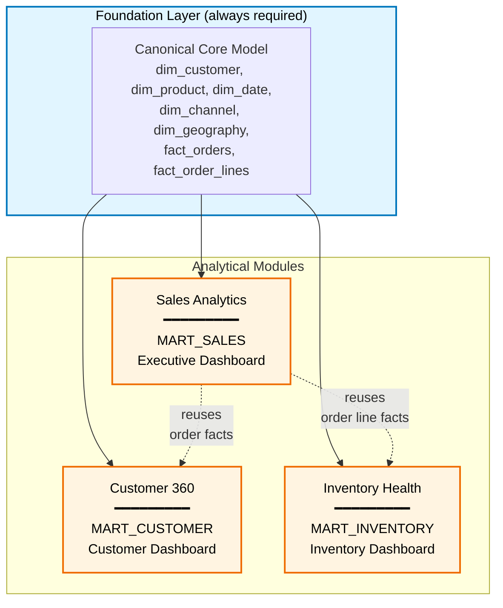

# Section 3: Module Breakdown

> **Document status:** Draft v1
> **Audience:** Engineering team, sales/product, technical clients
> **Purpose:** Define the three analytical modules that make up the Spark Retail Pack v1 — what each contains, what business questions they answer, how they depend on each other, and which artifacts each requires

---

## 3.1 Why modules?

The Spark Retail Pack is not delivered as a single monolithic warehouse. It is delivered as **modules** that clients can adopt independently and incrementally. This is deliberate:

- **It lowers the cost of entry.** A client can buy and deploy one module to prove value before committing to the whole platform.
- **It accelerates time-to-value.** Sales Analytics alone delivers measurable ROI in 2–3 weeks; waiting for everything would delay that.
- **It enables clean upsell paths.** Each module is a separate sales conversation with a clear scope.
- **It contains complexity.** Issues in one module don't block others; teams can work on modules in parallel.
- **It maps to organizational reality.** Finance owns Sales Analytics, Marketing owns Customer 360, Operations owns Inventory Health. Buyers and users align to modules.

Each module is a coherent analytical product on its own, built on the shared canonical data model. Modules share dimensions and some facts but have their own marts, KPIs, and dashboards.

---

## 3.2 The three modules in v1

| # | Module | Primary buyer | What it answers | Output mart | Dashboard pack |
|---|---|---|---|---|---|
| 1 | **Sales Analytics** | Finance, CEO | "How much are we selling, where, and how is it trending?" | `MART_SALES` | Executive Summary |
| 2 | **Customer 360** | Marketing, Growth | "Who are our customers and how are they behaving?" | `MART_CUSTOMER` | Customer 360 |
| 3 | **Inventory Health** | Operations, Supply Chain | "What's our stock position and how efficiently is it moving?" | `MART_INVENTORY` | Inventory Health |

These three were chosen because they cover the **minimum viable set of questions** that every retail/e-commerce executive asks weekly. A retail company without answers to these questions is flying blind. Anything beyond these (marketing attribution, fulfillment analytics, customer service) is valuable but is *additional*, not foundational.

---

## 3.3 Module dependency graph

Modules are not equally independent. Some need data produced by others.

**Key implications:**

- **Sales Analytics is foundational.** Both Customer 360 and Inventory Health need the order fact tables that Sales Analytics produces and curates. A client cannot deploy Customer 360 without also deploying Sales Analytics (the underlying tables, at minimum — the dashboard can be skipped).
- **Customer 360 and Inventory Health are siblings.** Neither depends on the other. They can be deployed in either order or in parallel after Sales Analytics is in place.
- **The canonical core model is shared.** All three modules consume the same `dim_customer`, `dim_product`, `dim_date`, etc. This is what enforces consistency — there is no separate "customer table" for Customer 360 vs. Sales.

### Recommended adoption order

For a client deploying all three:

1. **Weeks 1–2:** Canonical core + Sales Analytics
2. **Weeks 3–4:** Customer 360
3. **Weeks 5–6:** Inventory Health

A client adopting only one module gets the core plus that module — typically 2–3 weeks total.

---

## 3.4 Module 1: Sales Analytics

### Purpose

Provide a single source of truth for "how much we're selling" — revenue, orders, transactions, basic financial trends, and channel performance. This is the module that answers the questions a CEO asks every Monday morning.

### Business questions answered

- What was our revenue yesterday, last week, this month, this quarter, this year?
- How does this period compare to the prior period and to last year?
- Which sales channels drive the most revenue?
- What's our average order value, and how is it trending?
- What's our refund and return rate?
- Which product categories are growing fastest? Which are declining?
- Where geographically are our customers buying from?
- What's our tax exposure by region?

### Required canonical entities

**Dimensions:**

| Dimension | SCD Type | Notes |
|---|---|---|
| `dim_customer` | Type 1 in this module | Sales Analytics needs customer existence and basic attributes, not full history — that's Customer 360's concern |
| `dim_product` | Type 2 | Need product attribute history for accurate historical attribution |
| `dim_date` | N/A | Full date dimension with fiscal calendar support |
| `dim_channel` | Type 1 | Online store, marketplaces, retail, B2B |
| `dim_geography` | Type 1 | Country, state/region, city — for revenue mapping and tax |
| `dim_payment_method` | Type 1 | Card, wallet, BNPL, gift card |

**Facts:**

| Fact | Grain | Notes |
|---|---|---|
| `fact_orders` | One row per order (header) | Order-level totals, status, channel, customer |
| `fact_order_lines` | One row per line item per order | SKU-level revenue, quantity, discount |
| `fact_refunds` | One row per refund event | Tied back to `fact_orders` via `order_sk` |

### Required source data

| Source | What we pull | Why |
|---|---|---|
| **Shopify** | orders, order_line_items, customers, products, refunds | Primary commerce system |
| **Stripe** | charges, refunds, disputes | Payment confirmations, especially for non-Shopify revenue |

GA4, Meta Ads, and Klaviyo are **not** required for Sales Analytics. This module is intentionally narrow — pure transaction reporting.

### KPIs in this module (9)

Full formulas and metric definitions are in Section 5: KPI Catalog. Provisional list:

1. **Gross Merchandise Value (GMV)** — total sales before refunds, discounts excluded based on definition
2. **Net Revenue** — gross sales minus refunds, returns, and discounts
3. **Order Count** — total completed orders
4. **Average Order Value (AOV)** — net revenue / order count
5. **Revenue Growth %** — period-over-period change in net revenue
6. **Refund Rate** — refunds / gross revenue
7. **Return Rate** — returned units / units sold
8. **Revenue by Channel** — net revenue split by channel dimension
9. **Tax Collected** — total tax across orders, by region

### Output mart: `MART_SALES`

Tables produced:

- `sales_daily_summary` — pre-aggregated daily revenue by channel, geography, category
- `sales_order_facts_enriched` — order-level table joined with customer, product, channel, geography
- `sales_period_comparisons` — current period vs. prior period vs. year-ago, pre-computed
- `sales_top_products` — top SKUs by revenue, rolling 7/30/90 day windows
- `sales_refunds_summary` — refund trends and reasons

### Dashboard pack: Executive Summary

Single Power BI file with the following pages:

- **Overview** — today's revenue, MTD, QTD, YTD with comparisons
- **Channels** — revenue split, channel performance trends
- **Products** — top sellers, category performance, gross margin (if cost data available)
- **Geography** — revenue map, regional trends
- **Refunds & Returns** — rates, top reasons, financial impact

### Open-source vs. Pro split for this module

| Component | Open Source | Proprietary |
|---|---|---|
| Core fact tables | ✅ | |
| Basic 9 KPIs | ✅ (5 of them: GMV, Net Revenue, Order Count, AOV, Growth %) | 4 advanced (cohort revenue, weighted growth, etc.) |
| Mart tables | ✅ | |
| Executive Summary dashboard | | ✅ |

---

## 3.5 Module 2: Customer 360

### Purpose

Understand customers — who they are, how they behave, what they're worth, and how to retain them. This module answers the questions a CMO or Head of Growth asks: where to spend, who to retain, what's working.

### Business questions answered

- Who are our customers? How are they segmented?
- How many active customers do we have today, this month, this quarter?
- How many are new vs. repeat?
- What's the lifetime value of a customer (basic)?
- What's our repeat purchase rate?
- How much does it cost us to acquire a customer (CAC) by channel?
- What's our return on ad spend (ROAS) by channel and campaign?
- How are customers engaging with email and ads?
- Which customers are at risk of churning?

### Required canonical entities

**Dimensions:**

| Dimension | SCD Type | Notes |
|---|---|---|
| `dim_customer` | **Type 2 (full SCD2)** | This module needs the full history — when customers changed segment, address, status |
| `dim_product` | Type 2 | For category-level customer analysis |
| `dim_date` | N/A | |
| `dim_channel` | Type 1 | For acquisition channel attribution |
| `dim_geography` | Type 1 | For geographic segmentation |
| `dim_marketing_campaign` | Type 2 | For attribution of customer acquisition to campaigns |
| `dim_email_campaign` | Type 1 | For Klaviyo email engagement |

**Facts:**

| Fact | Grain | Notes |
|---|---|---|
| `fact_orders` | One row per order (header) | Reused from Sales Analytics |
| `fact_order_lines` | One row per line item | Reused from Sales Analytics |
| `fact_marketing_spend` | One row per campaign per day | Daily ad spend by campaign and channel |
| `fact_web_sessions` | One row per session | From GA4; visitor behavior and acquisition source |
| `fact_email_engagement` | One row per email event (sent, opened, clicked, unsubscribed) | From Klaviyo |
| `fact_customer_state_daily` | One row per customer per day | Snapshot fact — customer status, segment, RFM tier — daily |

### Required source data

| Source | What we pull | Why |
|---|---|---|
| Shopify | customers, orders, order_line_items | Foundation of customer purchase behavior |
| Stripe | customers, charges | Cross-reference, especially for non-Shopify customers |
| **Google Analytics 4** | sessions, events, traffic_sources | Web behavior, acquisition attribution |
| **Meta Ads** | campaigns, ad_sets, ads, daily_insights | Ad spend, ROAS calculation |
| **Klaviyo** | profiles, events, campaigns, flows | Email engagement, retention signals |

### KPIs in this module (9)

Provisional list:

1. **Active Customers (30/90 day)** — customers with purchase in trailing 30 or 90 days
2. **New Customers** — first-time purchasers in period
3. **Repeat Customer Count** — customers with 2+ purchases
4. **Repeat Purchase Rate** — repeat customers / total customers
5. **Customer Lifetime Value (basic)** — gross revenue per customer to date (no predictive component in v1)
6. **Average Time Between Orders** — for repeat customers
7. **Customer Acquisition Cost (CAC) by Channel** — marketing spend / new customers, split by channel
8. **Return on Ad Spend (ROAS) by Channel** — attributed revenue / ad spend
9. **Email Engagement Rate** — opens, clicks, conversions from email

### Output mart: `MART_CUSTOMER`

Tables produced:

- `customer_lifetime_metrics` — one row per customer with LTV-to-date, order count, last order date, segment
- `customer_segments_daily` — daily snapshot of which segment each customer is in
- `customer_acquisition_funnel` — visitor → lead → first order, by channel
- `customer_cohorts_monthly` — monthly acquisition cohorts with retention curves
- `marketing_channel_performance` — daily spend, customers acquired, ROAS by channel
- `customer_engagement_summary` — purchase, email, and web engagement per customer

### Dashboard pack: Customer 360

Single Power BI file:

- **Overview** — active customers, new vs. repeat split, LTV summary
- **Segments** — segment breakdown, segment movement over time
- **Acquisition** — CAC by channel, ROAS, new customer funnel
- **Retention** — repeat purchase rate, cohort retention, churn risk
- **Engagement** — email performance, web behavior, multi-channel touch counts

### Open-source vs. Pro split for this module

| Component | Open Source | Proprietary |
|---|---|---|
| Core fact tables | ✅ | |
| Basic customer dimension | ✅ | |
| Basic KPIs (active customers, new customers, repeat rate, basic CAC) | ✅ | |
| Advanced KPIs (LTV cohorts, ROAS, segment movement) | | ✅ |
| RFM segmentation logic | | ✅ |
| Cohort retention models | | ✅ |
| Customer 360 dashboard | | ✅ |

This module has the heaviest pro-side weighting because customer analytics is where retailers see the most differentiated value — and where Spark's IP is hardest to replicate.

---

## 3.6 Module 3: Inventory Health

### Purpose

Give operations and supply chain teams real-time visibility into stock position, movement, and efficiency. Prevent stockouts on bestsellers and identify capital tied up in slow-moving inventory.

### Business questions answered

- What's our current stock position across all SKUs?
- Which SKUs are at risk of stockout in the next 7/14/30 days?
- Which SKUs are overstocked or slow-moving?
- What's our inventory turnover by category?
- What's our sell-through rate on new arrivals?
- How much capital is tied up in inventory by category and location?
- What's the value of our inventory at risk (slow movers, deadstock)?

### Required canonical entities

**Dimensions:**

| Dimension | SCD Type | Notes |
|---|---|---|
| `dim_product` | Type 2 | Need full attribute history including cost changes |
| `dim_date` | N/A | |
| `dim_warehouse_location` | Type 1 | For multi-location retailers |
| `dim_supplier` | Type 1 | Stretch — only needed if cost analytics are in scope |

**Facts:**

| Fact | Grain | Notes |
|---|---|---|
| `fact_inventory_snapshot` | One row per SKU per location per day | Daily snapshot fact — stock on hand, committed, available |
| `fact_inventory_movements` | One row per inventory event (receive, sale, adjustment, transfer) | Audit trail of stock changes |
| `fact_order_lines` | Reused from Sales Analytics | For computing sell-through |

### Required source data

| Source | What we pull | Why |
|---|---|---|
| Shopify | inventory_levels, inventory_items, products | Source of truth for stock |
| Shopify | orders, order_line_items | For computing sell-through and demand |

Stripe, GA4, Meta Ads, and Klaviyo are **not** required for Inventory Health.

### KPIs in this module (7)

Provisional list:

1. **Total Inventory Value** — sum of on-hand quantity × unit cost
2. **Inventory Turnover** — COGS / average inventory value, annualized
3. **Days of Supply** — current inventory / average daily sales rate
4. **Stockout Rate** — % of SKUs at zero stock during period
5. **Sell-Through Rate** — units sold / (units sold + units remaining), period-defined
6. **Slow-Moving SKU Count** — SKUs with no sales in trailing 60 days
7. **Overstock Value** — value of SKUs with >90 days of supply

### Output mart: `MART_INVENTORY`

Tables produced:

- `inventory_current_position` — current stock by SKU and location
- `inventory_health_daily` — daily snapshot with turnover, days of supply per SKU
- `inventory_at_risk` — SKUs flagged as at-risk (stockout or overstock)
- `inventory_movements_summary` — daily aggregated movements by reason
- `sell_through_by_category` — sell-through rates rolled up to category

### Dashboard pack: Inventory Health

Single Power BI file:

- **Overview** — total inventory value, turnover, days of supply
- **Stock Position** — current stock by SKU/category/location, drill-through to SKU detail
- **At Risk** — stockout candidates, overstock candidates, slow movers
- **Velocity** — sell-through, turnover by category, fastest/slowest movers
- **Movements** — inflow vs. outflow trends, adjustment audit

### Open-source vs. Pro split for this module

| Component | Open Source | Proprietary |
|---|---|---|
| Core inventory facts | ✅ | |
| Basic KPIs (total value, days of supply, stockout rate) | ✅ | |
| Advanced KPIs (turnover, sell-through, overstock detection) | | ✅ |
| Stock-at-risk flagging logic | | ✅ |
| Inventory Health dashboard | | ✅ |

---

## 3.7 Cross-module concerns

Some concerns span all three modules and are handled in the foundation layer:

### Shared dimensions

`dim_customer`, `dim_product`, `dim_date`, `dim_channel`, and `dim_geography` are built once in the core layer and referenced by all modules. Changes to these propagate everywhere — which is the point. Modifying the customer dimension to add a new attribute means it becomes available in Sales, Customer 360, and Inventory automatically.

### Time grain conventions

All three modules report on:

- Daily (operational)
- Weekly (Monday–Sunday by default; configurable)
- Monthly (calendar)
- Quarterly (calendar by default; fiscal supported via `dim_date` configuration)
- Yearly

The semantic layer enforces these as standard time grains. A KPI must declare which grains it supports.

### Currency handling

All amounts in the canonical core are stored in the **client's reporting currency** (set in pack configuration). Multi-currency transactions are converted at the silver layer using daily FX rates pulled from a shared rate source. Modules consume already-converted amounts and do not handle FX themselves.

### Customer identity resolution

A customer who buys via Shopify, pays via Stripe, and receives email from Klaviyo appears as three records in the bronze layer. The `int_customer_identity_resolution` intermediate model resolves these to a single canonical customer based on email match (primary), phone match (secondary), and optionally fuzzy name+address match (tertiary, configurable). This is done once and consumed by all modules.

### PII handling

PII fields (email, phone, full name, address) are tagged in the canonical core. By default, PII is hashed in the gold layer and visible in plaintext only in marts and only to roles with the `RETAIL_PII_VIEWER` permission. Modules inherit this — no module-specific PII handling is required.

---

## 3.8 What is deliberately not a module in v1

Several plausible modules are excluded from v1. The reasoning matters because clients (and the sales team) will ask:

| Excluded module | Why deferred |
|---|---|
| **Marketing Attribution** | Multi-touch attribution requires modeling decisions (first-touch, last-touch, U-shaped, data-driven) that vary by client. Basic ROAS lives in Customer 360; full attribution is a v2 module |
| **Fulfillment & Logistics** | Fulfillment systems vary enormously (in-house, 3PL, dropship) and connectors are bespoke. Defer until a real client demand pattern emerges |
| **Customer Service / Support** | Requires Zendesk, Gorgias, or similar — not in the v1 connector set |
| **Financial / Accounting** | Crosses into ERP/accounting territory (NetSuite, QuickBooks) — different buyer, different complexity |
| **Wholesale / B2B** | Different sales process, different facts (price tiers, credit terms, POs). Most v1 target clients are pure D2C |
| **Loyalty & Rewards** | Loyalty platforms (Smile, LoyaltyLion, Yotpo) are diverse and most clients don't have them yet |
| **Subscription / Recurring** | Recharge, Bold Subscriptions — important for some D2C, niche overall. Deferred to v2 if demand justifies |
| **Pricing & Promotion Analytics** | Requires deep promotion modeling. Basic discount tracking is in Sales Analytics |

Each of these is a candidate for a future v2 module. The decision criteria for adding them: at least 3 active clients asking, and a clear connector / data source path.

---

## 3.9 Module-to-source matrix

A summary view showing which sources are needed for which modules — useful for sales conversations ("do I need to connect Meta Ads if I only want Sales Analytics?").

| Source | Sales Analytics | Customer 360 | Inventory Health |
|---|---|---|---|
| Shopify | **Required** | Required | **Required** |
| Stripe | **Required** | Required | – |
| Google Analytics 4 | – | **Required** | – |
| Meta Ads | – | **Required** | – |
| Klaviyo | – | **Required** | – |

**Implication for sales:** A client who only wants Sales Analytics needs only Shopify + Stripe — a 30-minute connector setup. A client who wants Customer 360 needs all five sources, which is closer to a 1–2 day connector setup.

---

## 3.10 Module sizing summary

A high-level view of complexity per module. Detailed effort estimates live in Section 12: Build Roadmap.

| Module | New dimensions | New facts | Sources | KPIs | Mart tables | Dashboard pages | Relative complexity |
|---|---|---|---|---|---|---|---|
| Sales Analytics | 4 reused | 3 | 2 | 9 | 5 | 5 | **Low–Medium** |
| Customer 360 | 4 reused + 2 new | 4 new + 2 reused | 5 | 9 | 6 | 5 | **High** |
| Inventory Health | 2 reused + 2 new | 2 new + 1 reused | 1 | 7 | 5 | 5 | **Medium** |

Customer 360 is the most complex module — it touches the most sources, has the most novel facts, and is where the proprietary IP is most concentrated. It is also where the most client variation will surface, requiring careful customization point design.

---

## 3.11 Module open-source / pro distribution summary

A consolidated view of the open/pro split across modules (full detail in Section 11):

| Layer | Sales | Customer | Inventory |
|---|---|---|---|
| Source connectors (staging) | OSS | OSS | OSS |
| Canonical core (dims + facts) | OSS | OSS | OSS |
| Intermediate models | OSS | Mostly OSS | OSS |
| Basic KPIs (~half of each module's KPIs) | OSS | OSS | OSS |
| Advanced KPIs | Pro | Pro | Pro |
| Mart tables | OSS basic, Pro advanced | Pro | OSS basic, Pro advanced |
| Power BI dashboard pack | Pro | Pro | Pro |
| Semantic layer with full metadata | Pro | Pro | Pro |

Rough proportions:
- ~60% of model code is open source
- ~40% of model code (advanced KPIs and marts) is proprietary
- 100% of dashboards are proprietary
- 100% of the AI-ready semantic layer is proprietary

---

## 3.12 Summary

Three modules, sharing one canonical core, with a clear dependency order: Sales → Customer + Inventory. The modules are sized so that:

- A client can adopt any one module and get value
- The full set covers the foundational questions every D2C retailer needs answered
- Each module has a clear primary buyer in the client organization
- The open / pro split protects commercial value while still attracting open-source adoption

The next two sections operationalize this:

- **Section 4: Canonical Data Model** — every dimension and fact at column level, with types, keys, SCD strategy, and source mapping
- **Section 5: KPI Catalog** — every one of the 25 KPIs with formula, grain, owner, and module assignment

---

**Previous:** [Section 2: Architecture](./02_architecture.md)
**Next:** [Section 4 — Part 1: Canonical Data Model — Dimensions](./04_canonical_data_model_part1_dimensions.md)
