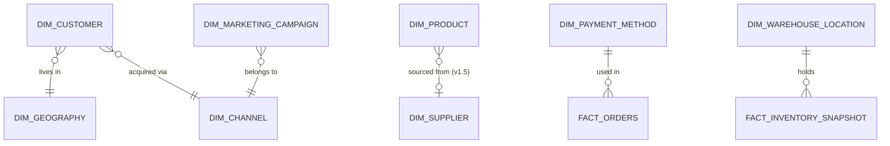

# Section 4 — Part 1: Canonical Data Model — Dimensions

> **Document status:** Draft v1
> **Audience:** Engineering team, technical clients, future contributors
> **Purpose:** Define every dimension in the canonical core layer at column level — types, keys, SCD strategy, source mapping, and PII handling. This is the contract that the gold layer commits to.

---

## 4.1 Scope and structure

This section defines the **dimensions** of the canonical core model. Facts are covered in Part 2.

The pack ships with **9 dimensions** in v1, divided into three tiers:

| Tier | Dimension | Used by |
|---|---|---|
| **Core conformed** (used by 2+ modules) | `dim_customer` | All modules |
| | `dim_product` | All modules |
| | `dim_date` | All modules |
| | `dim_channel` | Sales, Customer 360 |
| | `dim_geography` | Sales, Customer 360 |
| **Module-specific core** | `dim_payment_method` | Sales |
| | `dim_warehouse_location` | Inventory |
| | `dim_marketing_campaign` | Customer 360 |
| | `dim_email_campaign` | Customer 360 |
| **Deferred (v1.5)** | `dim_supplier` | Inventory (optional cost analytics) |

All dimensions live in the `CORE` schema of `ANALYTICS_RETAIL`.

---

## 4.2 Conventions used in this section

These conventions apply to every dimension definition below. They are stated once here rather than repeated in each table.

### Column types

- **String types** use Snowflake `VARCHAR` (effectively unbounded; no need to declare lengths).
- **Numeric currency amounts** use `NUMBER(18, 4)` — 4 decimal places, enough for fractions of a cent.
- **Quantities** use `NUMBER(18, 2)`.
- **Booleans** use Snowflake `BOOLEAN`.
- **Dates** use `DATE` (no time component).
- **Timestamps** use `TIMESTAMP_TZ` (timezone-aware).
- **Surrogate keys** use `VARCHAR` — generated by `dbt_utils.generate_surrogate_key()` (MD5 hash).

### Surrogate key generation

Every dimension has a surrogate key (`<entity>_sk`) generated by hashing the natural key plus, for SCD2 dimensions, the `valid_from` timestamp. This ensures:

- A given version of a customer always gets the same `customer_sk`
- Fact tables can foreign-key to a specific point-in-time version of a dimension
- No reliance on database-generated integers (which break across environments)

### SCD2 implementation

For SCD2 dimensions, every row carries:

| Column | Type | Meaning |
|---|---|---|
| `valid_from` | `TIMESTAMP_TZ` | When this version became effective |
| `valid_to` | `TIMESTAMP_TZ` | When this version was superseded (null for current) |
| `is_current` | `BOOLEAN` | TRUE for the latest version of each entity |

SCD2 is implemented using `dbt_snapshots` against the staging layer. Snapshot frequency is daily by default.

### PII classification

Every column is tagged with one of five classifications:

| Tag | Meaning | Examples |
|---|---|---|
| `public` | No restriction | Country, product category |
| `internal` | Business-confidential, not personal | Internal segment, channel, status flags |
| `confidential` | Sensitive business data | Cost, margin, supplier terms |
| `restricted` | Highly sensitive | Payment card data, internal financials |
| `pii` | Personally identifiable | Email, phone, full name, address |

`pii` columns are hashed by default in the gold layer. Plaintext versions are accessible only to roles with `RETAIL_PII_VIEWER` permission, and only via specific mart views (not directly from the dimension).

### Source mapping

Each dimension definition includes a source mapping table showing which canonical columns derive from which source fields. Where multiple sources contribute to one column, conflict resolution rules are documented.

### Audit and lineage columns (apply to every table)

**Every dimension and fact in the canonical core carries the following metadata columns**, in addition to the business columns listed in each table's definition. These columns are not repeated in each table's column list to avoid clutter, but they always exist.

| Column | Type | Description |
|---|---|---|
| `_source_system` | VARCHAR | The source that produced this record: `shopify`, `stripe`, `ga4`, `meta_ads`, `klaviyo`, or `generated` (for derived facts) |
| `_source_record_id` | VARCHAR | The original record ID at the source. Usually the same as the natural key, but explicit for cross-source traceability |
| `_extracted_at` | TIMESTAMP_TZ | When the data was extracted from the source system (set by the ingestion tool, e.g., Fivetran) |
| `_loaded_at` | TIMESTAMP_TZ | When the row was inserted into the bronze layer |
| `_dbt_invocation_id` | VARCHAR | The dbt run ID that produced this row. Useful for debugging and rollback |
| `_dbt_model` | VARCHAR | The dbt model that produced this row (e.g., `dim_customer`) |
| `_record_hash` | VARCHAR | SHA-256 hash of the business columns. Used for change detection without full row comparison |
| `_is_deleted_at_source` | BOOLEAN | TRUE if the row has been soft-deleted in the source system. Default FALSE |

**Why all eight:**

- `_source_system` + `_source_record_id` together let any row in any table be traced back to its origin
- `_extracted_at` and `_loaded_at` together measure pipeline latency (extracted_to_loaded delta)
- `_dbt_invocation_id` and `_dbt_model` together identify which transformation pass produced the row — invaluable when debugging "why does this row look wrong"
- `_record_hash` enables fast CDC: if the hash hasn't changed, the row hasn't changed
- `_is_deleted_at_source` preserves soft-delete state — important because hard-deleting from a warehouse loses analytical history

**Implementation:** these columns are populated by a single dbt macro (`add_audit_columns`) called at the end of every model. No model has to manage them individually.

The full audit and lineage strategy — including how columns are tracked at the model level, how dbt's native lineage graph is exposed, and how clients can query "where did this number come from" — is documented in Part 2, Section 4.31.

---

## 4.3 `dim_customer`

### Overview

Single record per customer per version. Customers are identity-resolved across all sources (Shopify, Stripe, Klaviyo) into one canonical record. The dimension tracks attribute changes over time via SCD2, so historical reporting reflects the customer's state at the time of each transaction.

### Metadata

| Property | Value |
|---|---|
| Grain | One row per customer per version |
| SCD Type | Type 2 |
| Source systems | Shopify (`customers`), Stripe (`customers`), Klaviyo (`profiles`) |
| Natural key | Resolved `customer_id` (hash of primary email lower-cased) |
| Surrogate key | `customer_sk` = MD5(`customer_id` + `valid_from`) |
| Refresh cadence | Daily snapshot |
| Used by | All modules |
| PII level | High |

### Columns

| # | Column | Type | Nullable | PII | Description |
|---|---|---|---|---|---|
| 1 | `customer_sk` | VARCHAR | No | public | Surrogate key — primary key of this dimension |
| 2 | `customer_id` | VARCHAR | No | internal | Canonical business key — stable across versions |
| 3 | `email_hash` | VARCHAR | No | internal | SHA-256 hash of lower-cased email — used for joins without exposing PII |
| 4 | `email` | VARCHAR | Yes | pii | Plaintext email — masked by default |
| 5 | `phone_hash` | VARCHAR | Yes | internal | SHA-256 hash of normalized phone |
| 6 | `phone` | VARCHAR | Yes | pii | Plaintext phone — masked by default |
| 7 | `first_name` | VARCHAR | Yes | pii | First name |
| 8 | `last_name` | VARCHAR | Yes | pii | Last name |
| 9 | `customer_status` | VARCHAR | No | internal | One of: `active`, `dormant`, `churned`, `blocked` |
| 10 | `customer_segment` | VARCHAR | Yes | internal | Basic RFM-derived segment (advanced segments in pro) |
| 11 | `acquisition_channel` | VARCHAR | Yes | internal | Channel where the customer first appeared |
| 12 | `acquisition_source_system` | VARCHAR | No | internal | Which source first observed this customer: `shopify`, `stripe`, `klaviyo` |
| 13 | `acquisition_date` | DATE | Yes | internal | Date of first interaction |
| 14 | `first_order_date` | DATE | Yes | internal | Date of first completed order |
| 15 | `last_seen_at` | TIMESTAMP_TZ | No | internal | Most recent activity across any source (purchase, session, email open) |
| 16 | `is_b2b_customer` | BOOLEAN | No | internal | TRUE for business customers (derived from tags or order patterns) |
| 17 | `customer_tags` | ARRAY | Yes | internal | Client-defined tags from Shopify/Klaviyo (e.g., `vip`, `wholesale`) |
| 18 | `preferred_currency` | VARCHAR | Yes | internal | ISO 4217 currency code |
| 19 | `country_code` | VARCHAR | Yes | internal | ISO 3166-1 alpha-2 — FK to `dim_geography` |
| 20 | `region` | VARCHAR | Yes | internal | State or province |
| 21 | `city` | VARCHAR | Yes | pii | City (PII because combined with name = identifying) |
| 22 | `postal_code_hash` | VARCHAR | Yes | internal | Hashed postal code |
| 23 | `marketing_consent` | BOOLEAN | No | internal | Has the customer opted in to marketing |
| 24 | `email_subscribed` | BOOLEAN | No | internal | Email marketing subscription status |
| 25 | `sms_subscribed` | BOOLEAN | No | internal | SMS marketing subscription status |
| 26 | `source_systems` | ARRAY | No | public | Sources this customer was found in: `[shopify, stripe, klaviyo]` |
| 27 | `identity_resolution_method` | VARCHAR | No | internal | How this customer was matched: `email`, `phone`, `fuzzy_name_address`, or `unmatched` |
| 28 | `match_confidence` | VARCHAR | No | internal | Confidence of identity match: `high` or `medium` |
| 29 | `created_at` | TIMESTAMP_TZ | No | internal | First time we saw this customer in any source |
| 30 | `updated_at` | TIMESTAMP_TZ | No | internal | When this version was created |
| 31 | `valid_from` | TIMESTAMP_TZ | No | internal | SCD2: when this version became effective |
| 32 | `valid_to` | TIMESTAMP_TZ | Yes | internal | SCD2: when this version was superseded |
| 33 | `is_current` | BOOLEAN | No | internal | SCD2: TRUE for the latest version |

**Not in this dimension (lives in marts instead):** total orders count, total spent, last order date, LTV, churn probability, days since last order. These are aggregates and belong in `customer_lifetime_metrics` or similar mart tables.

### Source mapping

| Canonical column | Shopify field | Stripe field | Klaviyo field | Resolution rule |
|---|---|---|---|---|
| `customer_id` | derived | derived | derived | Hash of lower-cased primary email |
| `email` | `email` | `email` | `email` | Shopify wins; fall back to Stripe; fall back to Klaviyo |
| `phone` | `phone` | `phone` | `phone_number` | Shopify wins; fall back to Stripe; fall back to Klaviyo |
| `first_name`, `last_name` | `first_name`, `last_name` | `name` (split) | `first_name`, `last_name` | Most recently updated wins |
| `acquisition_channel` | derived from `created_at` < other systems | derived | derived | Source that has the earliest record for this customer |
| `country_code` | `default_address.country_code` | `address.country` | `location.country` | Shopify default_address wins |
| `marketing_consent` | `accepts_marketing` | n/a | `consent_status` | Klaviyo wins (most current) |

### Identity resolution

The `int_customer_identity_resolution` intermediate model performs the merge across sources using a **tiered matching strategy**. Each tier has a documented confidence level. Lower-confidence matches are flagged so analysts and clients can choose how to handle them.

**Tier 1 — Deterministic email match (highest confidence)**

1. Normalize all emails to lowercase, trim whitespace.
2. Hash each normalized email with SHA-256.
3. Group records across Shopify, Stripe, and Klaviyo by `email_hash`.
4. Records that match are considered the same customer with `match_confidence = 'high'`.

**Tier 2 — Deterministic phone match (high confidence)**

5. For records without an email match, normalize phone numbers to E.164 format.
6. Hash and match by phone.
7. Records matched this way get `match_confidence = 'high'` (phone is a strong identifier).

**Tier 3 — Fuzzy name + address match (medium confidence)**

8. For records still unmatched, compute a composite fuzzy key on (first_name + last_name + postal_code + country_code).
9. Names are normalized (lowercased, accents stripped, common abbreviations expanded — "J." → "James" via configurable dictionary).
10. Postal codes are normalized to first 5 characters for the US, first 3–4 for UK/Canada (deliberately fuzzy at the prefix level).
11. Use Jaro-Winkler similarity on the name component with a configurable threshold (default 0.92).
12. Matches at this tier get `match_confidence = 'medium'` and are flagged in `dim_customer.identity_resolution_method`.

**Configuration and overrides**

- `vars.fuzzy_matching_enabled` (default `true`) — turn off Tier 3 entirely
- `vars.fuzzy_name_similarity_threshold` (default `0.92`) — raise for stricter matching, lower for more aggressive
- `vars.require_postal_match` (default `true`) — require exact postal code match alongside fuzzy name

**Two new columns added to `dim_customer` to support this:**

- `identity_resolution_method` VARCHAR — `email`, `phone`, `fuzzy_name_address`, or `unmatched`
- `match_confidence` VARCHAR — `high` or `medium`

**Operational guidance:**

Clients should review medium-confidence matches before relying on them for marketing or analytics. The pack ships with a diagnostic view (`vw_identity_resolution_review`) that surfaces all medium-confidence merges with the original records side-by-side. Clients can override matches via a `seeds/identity_overrides.csv` file:

```csv
customer_id_to_merge_into, customer_id_to_merge_from, action
abc123, def456, merge          # force these two to be the same customer
ghi789, jkl012, split          # force these two to remain separate (overrides fuzzy match)
```

**Trade-offs:**

Fuzzy matching catches the real-world case where a customer types "Bob Smith" on Shopify but "Robert Smith" on Klaviyo (with the same address). It also introduces false positives — two different "John Smiths" in the same postal code. The override seed and confidence flagging together let clients trust the data while retaining control.

This decision is recorded in [ADR-003: Fuzzy Identity Resolution](../07_decisions/ADR-003-fuzzy-identity-resolution.md).

### Open-source vs. Pro

- ✅ Open source: full dimension, all columns, identity resolution
- 💼 Proprietary: advanced segmentation logic (RFM tier assignment, predictive churn segment) — populates `customer_segment` beyond basic values

---

## 4.4 `dim_product`

### Overview

Single record per product variant (SKU) per version. SCD2 captures attribute changes — especially price changes, cost changes, and product reclassifications — so historical analysis attributes correctly.

### Metadata

| Property | Value |
|---|---|
| Grain | One row per SKU per version |
| SCD Type | Type 2 |
| Source systems | Shopify (`products`, `variants`) |
| Natural key | `sku` (Shopify variant SKU) |
| Surrogate key | `product_sk` = MD5(`sku` + `valid_from`) |
| Refresh cadence | Daily snapshot |
| Used by | All modules |
| PII level | None |

### Columns

| # | Column | Type | Nullable | PII | Description |
|---|---|---|---|---|---|
| 1 | `product_sk` | VARCHAR | No | public | Surrogate key |
| 2 | `sku` | VARCHAR | No | public | Stock-keeping unit — natural key |
| 3 | `product_id` | VARCHAR | No | public | Shopify product ID (parent of variants) |
| 4 | `variant_id` | VARCHAR | No | public | Shopify variant ID |
| 5 | `product_title` | VARCHAR | No | public | Parent product title |
| 6 | `variant_title` | VARCHAR | Yes | public | Variant title (e.g., "Large / Red") |
| 7 | `display_name` | VARCHAR | No | public | Concatenated `product_title` + `variant_title` for display |
| 8 | `barcode` | VARCHAR | Yes | public | UPC, EAN, or other barcode — useful for POS reconciliation |
| 9 | `product_handle` | VARCHAR | Yes | public | URL-friendly slug (e.g., `red-cotton-tshirt`) — used for joining to GA4 page paths |
| 10 | `image_url` | VARCHAR | Yes | public | Primary product image URL — for dashboard thumbnails |
| 11 | `product_type` | VARCHAR | Yes | public | Shopify product type |
| 12 | `category` | VARCHAR | Yes | public | Derived top-level category |
| 13 | `subcategory` | VARCHAR | Yes | public | Derived second-level category |
| 14 | `vendor` | VARCHAR | Yes | public | Shopify vendor field |
| 15 | `brand` | VARCHAR | Yes | public | Brand (typically same as vendor; configurable) |
| 16 | `tags` | ARRAY | Yes | public | Shopify tags array |
| 17 | `unit_price` | NUMBER(18,4) | No | public | Current selling price |
| 18 | `compare_at_price` | NUMBER(18,4) | Yes | public | "Original" or compare-at price for discount display |
| 19 | `unit_cost` | NUMBER(18,4) | Yes | confidential | Cost of goods — when Shopify cost is populated |
| 20 | `currency_code` | VARCHAR | No | public | ISO 4217 |
| 21 | `weight` | NUMBER(18,2) | Yes | public | Weight |
| 22 | `weight_unit` | VARCHAR | Yes | public | One of: `g`, `kg`, `lb`, `oz` |
| 23 | `is_taxable` | BOOLEAN | No | public | Whether tax applies |
| 24 | `requires_shipping` | BOOLEAN | No | public | Physical vs. digital good |
| 25 | `is_active` | BOOLEAN | No | public | Currently available for sale |
| 26 | `inventory_tracked` | BOOLEAN | No | public | Whether Shopify tracks inventory for this SKU |
| 27 | `inventory_policy` | VARCHAR | Yes | public | One of: `deny` (block sale at 0 stock), `continue` (oversell allowed) |
| 28 | `created_at` | TIMESTAMP_TZ | No | public | When the product was first added |
| 29 | `updated_at` | TIMESTAMP_TZ | No | public | When this version was created |
| 30 | `valid_from` | TIMESTAMP_TZ | No | public | SCD2 |
| 31 | `valid_to` | TIMESTAMP_TZ | Yes | public | SCD2 |
| 32 | `is_current` | BOOLEAN | No | public | SCD2 |

### Source mapping

| Canonical column | Shopify field | Notes |
|---|---|---|
| `sku` | `variants.sku` | Required — products without SKUs are filtered out at staging |
| `product_title` | `products.title` | |
| `variant_title` | `variants.title` | |
| `category` | derived from `products.product_type` | Single config-driven mapping function |
| `unit_price` | `variants.price` | |
| `unit_cost` | `variants.cost` (via Shopify cost-of-goods feature) | May be null for clients not using Shopify COGS |
| `vendor`, `brand` | `products.vendor` | Brand defaults to vendor; can be overridden via product tags |

### Category derivation

Shopify's `product_type` is a freeform string and varies wildly across clients. The pack ships with a configurable mapping seed (`seeds/product_category_mapping.csv`) that maps raw product types to standardized categories:

| product_type (raw) | category | subcategory |
|---|---|---|
| "Men's Shirts" | Apparel | Tops |
| "Women's Dresses" | Apparel | Dresses |
| "Coffee Beans" | Food & Beverage | Coffee |

Clients can override this mapping at deployment time. Products with no mapping default to category `Uncategorized`.

### Open-source vs. Pro

- ✅ Open source: full dimension, category mapping framework
- 💼 Proprietary: pre-built category mapping libraries for common verticals (apparel, beauty, home goods, food)

---

## 4.5 `dim_date`

### Overview

Standard generated date dimension covering 10 years history + 5 years future from the current date. Generated by macro, not sourced from external data. Supports fiscal calendars via configuration.

### Metadata

| Property | Value |
|---|---|
| Grain | One row per calendar date |
| SCD Type | Not applicable |
| Source | Generated by `dbt_date` package |
| Natural key | `date_actual` |
| Surrogate key | `date_sk` (integer in `YYYYMMDD` format, e.g., `20260513`) |
| Refresh cadence | On each dbt build (idempotent) |
| Used by | All modules |
| PII level | None |

### Columns

| # | Column | Type | Description |
|---|---|---|---|
| 1 | `date_sk` | NUMBER | YYYYMMDD integer — primary key |
| 2 | `date_actual` | DATE | The actual date |
| 3 | `day_of_week` | NUMBER | 1 = Monday through 7 = Sunday |
| 4 | `day_name` | VARCHAR | "Monday", "Tuesday", etc. |
| 5 | `day_short_name` | VARCHAR | "Mon", "Tue", etc. |
| 6 | `day_of_month` | NUMBER | 1–31 |
| 7 | `day_of_year` | NUMBER | 1–366 |
| 8 | `is_weekend` | BOOLEAN | TRUE for Saturday and Sunday |
| 9 | `is_weekday` | BOOLEAN | TRUE for Monday–Friday |
| 10 | `is_holiday` | BOOLEAN | Configured per client region |
| 11 | `holiday_name` | VARCHAR | E.g., "Christmas Day", "Black Friday" |
| 12 | `is_business_day` | BOOLEAN | Weekday AND not holiday |
| 13 | `week_of_year` | NUMBER | ISO week number |
| 14 | `week_starting_date` | DATE | Monday of the week |
| 15 | `week_ending_date` | DATE | Sunday of the week |
| 16 | `month_number` | NUMBER | 1–12 |
| 17 | `month_name` | VARCHAR | "January", "February", etc. |
| 18 | `month_short_name` | VARCHAR | "Jan", "Feb", etc. |
| 19 | `month_starting_date` | DATE | First of the month |
| 20 | `month_ending_date` | DATE | Last of the month |
| 21 | `quarter_number` | NUMBER | 1–4 |
| 22 | `quarter_name` | VARCHAR | "Q1", "Q2", etc. |
| 23 | `year` | NUMBER | Calendar year |
| 24 | `fiscal_year` | NUMBER | Fiscal year (configured by client) |
| 25 | `fiscal_quarter` | NUMBER | Fiscal quarter |
| 26 | `fiscal_month` | NUMBER | Fiscal month within fiscal year |
| 27 | `prior_year_date_sk` | NUMBER | Same calendar day, previous year |
| 28 | `prior_year_date_actual` | DATE | Same calendar day, previous year |
| 29 | `days_from_today` | NUMBER | Signed: negative for past, positive for future, 0 for today |
| 30 | `is_today` | BOOLEAN | TRUE for today |
| 31 | `is_yesterday` | BOOLEAN | TRUE for yesterday |
| 32 | `is_current_week` | BOOLEAN | TRUE for dates within the current week |
| 33 | `is_current_month` | BOOLEAN | TRUE for dates within the current calendar month |
| 34 | `is_current_quarter` | BOOLEAN | TRUE for dates within the current calendar quarter |
| 35 | `is_current_year` | BOOLEAN | TRUE for dates within the current calendar year |
| 36 | `is_current_fiscal_year` | BOOLEAN | TRUE for dates within the current fiscal year |
| 37 | `is_wtd` | BOOLEAN | Week-to-date: dates within current week and ≤ today |
| 38 | `is_mtd` | BOOLEAN | Month-to-date |
| 39 | `is_qtd` | BOOLEAN | Quarter-to-date |
| 40 | `is_ytd` | BOOLEAN | Year-to-date (calendar) |
| 41 | `is_fytd` | BOOLEAN | Fiscal year-to-date |
| 42 | `is_last_7_days` | BOOLEAN | Within trailing 7 days |
| 43 | `is_last_30_days` | BOOLEAN | Within trailing 30 days |
| 44 | `is_last_90_days` | BOOLEAN | Within trailing 90 days |
| 45 | `is_last_365_days` | BOOLEAN | Within trailing 365 days |

**Note on relative flags:** Columns 29–45 are recomputed on every dbt build because "today" changes. This is intentional and inexpensive (one table refresh per day). It saves every downstream report from computing "what's in MTD?" every query.

### Holiday configuration

`is_holiday` and `holiday_name` are populated from a configurable seed file. The pack ships with US, UK, Canada, Australia, and Kenya holiday calendars. Clients add their own via `seeds/holidays.csv`.

### Fiscal calendar configuration

Defaults to calendar year. Clients with a different fiscal year set `vars.fiscal_year_start_month` in `dbt_project.yml` (e.g., `7` for July).

### Open-source vs. Pro

- ✅ Open source: entire dimension including all features above

---

## 4.6 `dim_channel`

### Overview

Channels split into two types: **sales channels** (where a transaction occurred — online store, marketplace, retail) and **acquisition channels** (where a customer or session originated — organic search, paid social, direct). Some channels are both.

### Metadata

| Property | Value |
|---|---|
| Grain | One row per channel |
| SCD Type | Type 1 (changes are rare and we don't track history) |
| Source | Combination of Shopify (sales channels), GA4 (traffic sources), Meta Ads (paid channels), seed file |
| Natural key | `channel_id` |
| Surrogate key | `channel_sk` |
| Refresh cadence | Daily, mostly stable |
| Used by | Sales, Customer 360 |
| PII level | None |

### Columns

| # | Column | Type | Description |
|---|---|---|---|
| 1 | `channel_sk` | VARCHAR | Surrogate key |
| 2 | `channel_id` | VARCHAR | Stable channel identifier |
| 3 | `channel_name` | VARCHAR | Display name (e.g., "Online Store", "Facebook Ads") |
| 4 | `channel_category` | VARCHAR | Broad grouping: `online_store`, `marketplace`, `retail`, `social`, `search`, `email`, `direct`, `referral`, `other` |
| 5 | `channel_subcategory` | VARCHAR | More specific (e.g., `paid_social`, `organic_social`) |
| 6 | `channel_type` | VARCHAR | `sales`, `acquisition`, or `both` |
| 7 | `platform` | VARCHAR | Where applicable: `shopify`, `amazon`, `facebook`, `instagram`, `google`, `tiktok` |
| 8 | `parent_channel` | VARCHAR | Hierarchical grouping (e.g., "Facebook Ads" → "Meta") |
| 9 | `is_paid` | BOOLEAN | TRUE for channels with associated spend |
| 10 | `is_owned` | BOOLEAN | TRUE for channels we own (email, owned site) |
| 11 | `is_active` | BOOLEAN | Currently in use |
| 12 | `created_at` | TIMESTAMP_TZ | When this channel was first observed |

### Seed-driven channel mapping

A core challenge: GA4 reports traffic sources as `(google / organic)`, Meta Ads as `Facebook_Conversion_Campaign_2026`, and Shopify reports sales channels as `web`, `pos`, `instagram`. The pack ships with a seed file that maps these to a canonical channel:

```csv
source_system, source_value, channel_id, channel_name, channel_category, channel_subcategory, is_paid
ga4, "google / organic", organic_search_google, "Google Organic", search, organic_search, false
ga4, "google / cpc", paid_search_google, "Google Ads", search, paid_search, true
meta_ads, *, paid_social_meta, "Meta Ads", social, paid_social, true
shopify, web, online_store, "Online Store", online_store, online_store, false
shopify, pos, retail_pos, "Retail POS", retail, in_store, false
```

Clients override this seed at deployment.

### Open-source vs. Pro

- ✅ Open source: full dimension, base seed file with common mappings
- 💼 Proprietary: extended seed library (50+ pre-mapped sources for the top retail ad platforms)

---

## 4.7 `dim_geography`

### Overview

Hierarchical geographic dimension at country and state/region grain. City is captured as an attribute on `dim_customer` and on order facts (because cities are numerous and most aren't analytically interesting).

### Metadata

| Property | Value |
|---|---|
| Grain | One row per country + state/region combination (e.g., one row for "US-CA", one for "US-NY", one for "UK") |
| SCD Type | Type 1 (geographies don't change meaningfully) |
| Source | Seed file (ISO-derived) |
| Natural key | `geography_id` (country_code + region_code) |
| Surrogate key | `geography_sk` |
| Refresh cadence | Static (rebuilt only when seed changes) |
| Used by | Sales, Customer 360 |
| PII level | None |

### Columns

| # | Column | Type | Description |
|---|---|---|---|
| 1 | `geography_sk` | VARCHAR | Surrogate key |
| 2 | `geography_id` | VARCHAR | E.g., `US-CA`, `UK`, `KE-30` |
| 3 | `country_code` | VARCHAR | ISO 3166-1 alpha-2 |
| 4 | `country_name` | VARCHAR | E.g., "United States" |
| 5 | `country_region` | VARCHAR | Continental region: `Americas`, `EMEA`, `APAC` |
| 6 | `country_subregion` | VARCHAR | E.g., `North America`, `Western Europe` |
| 7 | `state_or_region_code` | VARCHAR | E.g., `CA` for California — null for countries without sub-regions |
| 8 | `state_or_region_name` | VARCHAR | E.g., "California" |
| 9 | `default_currency` | VARCHAR | ISO 4217 currency for the country |
| 10 | `default_timezone` | VARCHAR | IANA timezone for the country/region |
| 11 | `is_tax_jurisdiction` | BOOLEAN | Whether this region has its own tax rules |

### Source

Ships as a seed file (`seeds/dim_geography.csv`) with ~250 countries and ~3,500 sub-regions pre-loaded. Updated annually.

### Open-source vs. Pro

- ✅ Open source: full dimension

---

## 4.8 `dim_payment_method`

### Overview

Payment methods used for transactions. Includes type (card, wallet, BNPL, etc.) and provider (Visa, PayPal, Klarna, etc.). Useful for cohort analysis by payment type and for understanding chargebacks.

### Metadata

| Property | Value |
|---|---|
| Grain | One row per payment method |
| SCD Type | Type 1 |
| Source | Stripe (`payment_methods`, `charges.payment_method_details`) |
| Natural key | `payment_method_id` |
| Surrogate key | `payment_method_sk` |
| Refresh cadence | Daily |
| Used by | Sales |
| PII level | None (card details are not stored — only types) |

### Columns

| # | Column | Type | Description |
|---|---|---|---|
| 1 | `payment_method_sk` | VARCHAR | Surrogate key |
| 2 | `payment_method_id` | VARCHAR | E.g., `card_visa_credit`, `wallet_applepay`, `bnpl_klarna` |
| 3 | `payment_method_name` | VARCHAR | Display name: "Visa Credit Card" |
| 4 | `payment_method_type` | VARCHAR | One of: `card`, `digital_wallet`, `bnpl`, `bank_transfer`, `gift_card`, `cash`, `crypto`, `other` |
| 5 | `payment_provider` | VARCHAR | E.g., `visa`, `mastercard`, `paypal`, `applepay`, `klarna`, `mpesa` |
| 6 | `card_brand` | VARCHAR | For cards only: `visa`, `mastercard`, `amex`, `discover` |
| 7 | `card_funding` | VARCHAR | For cards: `credit`, `debit`, `prepaid` |
| 8 | `is_credit_card` | BOOLEAN | Convenience flag |
| 9 | `is_digital_wallet` | BOOLEAN | Convenience flag |
| 10 | `is_bnpl` | BOOLEAN | Convenience flag |
| 11 | `is_recurring_capable` | BOOLEAN | Can this method support subscriptions |

### Open-source vs. Pro

- ✅ Open source: full dimension

---

## 4.9 `dim_warehouse_location`

### Overview

Physical locations where inventory is stored or fulfilled from. Includes warehouses, stores with backroom stock, supplier locations (for dropship), and 3PL facilities.

### Metadata

| Property | Value |
|---|---|
| Grain | One row per location |
| SCD Type | Type 1 |
| Source | Shopify (`locations`) |
| Natural key | `location_id` |
| Surrogate key | `location_sk` |
| Refresh cadence | Daily |
| Used by | Inventory |
| PII level | None |

### Columns

| # | Column | Type | Description |
|---|---|---|---|
| 1 | `location_sk` | VARCHAR | Surrogate key |
| 2 | `location_id` | VARCHAR | Shopify location ID |
| 3 | `location_name` | VARCHAR | E.g., "Main Warehouse - California" |
| 4 | `location_type` | VARCHAR | One of: `warehouse`, `store`, `supplier`, `3pl`, `virtual` |
| 5 | `country_code` | VARCHAR | ISO country code |
| 6 | `state_or_region` | VARCHAR | |
| 7 | `city` | VARCHAR | |
| 8 | `timezone` | VARCHAR | IANA timezone |
| 9 | `is_fulfillment_location` | BOOLEAN | Whether orders can ship from here |
| 10 | `is_active` | BOOLEAN | Currently operational |
| 11 | `created_at` | TIMESTAMP_TZ | When the location was added |

### Open-source vs. Pro

- ✅ Open source: full dimension

---

## 4.10 `dim_marketing_campaign`

### Overview

Paid marketing campaigns. In v1, sources are Meta Ads (Facebook, Instagram). Future versions will add Google Ads, TikTok Ads, etc. SCD2 because campaign budgets, statuses, and creative associations change during the campaign lifecycle, and historical reporting must reflect this.

### Metadata

| Property | Value |
|---|---|
| Grain | One row per campaign per version |
| SCD Type | Type 2 |
| Source | Meta Ads (`campaigns`, `ad_sets`, `ads`) |
| Natural key | `campaign_id` (with platform prefix to avoid collisions) |
| Surrogate key | `campaign_sk` |
| Refresh cadence | Daily snapshot |
| Used by | Customer 360 |
| PII level | None |

### Columns

| # | Column | Type | Description |
|---|---|---|---|
| 1 | `campaign_sk` | VARCHAR | Surrogate key |
| 2 | `campaign_id` | VARCHAR | E.g., `meta_120203456789` |
| 3 | `platform` | VARCHAR | `meta`, future: `google`, `tiktok` |
| 4 | `campaign_name` | VARCHAR | As named in platform |
| 5 | `campaign_objective` | VARCHAR | `conversions`, `traffic`, `awareness`, `engagement`, `leads` |
| 6 | `campaign_status` | VARCHAR | `active`, `paused`, `completed`, `archived` |
| 7 | `buying_type` | VARCHAR | `auction`, `reserved` |
| 8 | `start_date` | DATE | Campaign start |
| 9 | `end_date` | DATE | Campaign end (null if ongoing) |
| 10 | `daily_budget` | NUMBER(18,4) | Daily budget cap (null if lifetime budget) |
| 11 | `lifetime_budget` | NUMBER(18,4) | Total budget cap (null if daily) |
| 12 | `bid_strategy` | VARCHAR | `lowest_cost`, `target_cost`, `bid_cap` |
| 13 | `target_audience` | VARCHAR | Audience name (custom audience or lookalike) |
| 14 | `channel_sk` | VARCHAR | FK to `dim_channel` — what channel this campaign belongs to |
| 15 | `utm_source` | VARCHAR | UTM source tag used for this campaign (e.g., `facebook`) |
| 16 | `utm_medium` | VARCHAR | UTM medium tag (e.g., `paid_social`) |
| 17 | `utm_campaign` | VARCHAR | UTM campaign tag — the join key to web sessions and orders |
| 18 | `created_at` | TIMESTAMP_TZ | When the campaign was created |
| 19 | `valid_from` | TIMESTAMP_TZ | SCD2 |
| 20 | `valid_to` | TIMESTAMP_TZ | SCD2 |
| 21 | `is_current` | BOOLEAN | SCD2 |

**Note on UTM tracking:** UTM parameters are how marketing spend is stitched to actual orders. The campaign's `utm_campaign` value must match the UTM parameter captured on `fact_web_sessions.traffic_campaign` and `fact_orders.utm_campaign` for attribution to work. Clients with inconsistent UTM tagging will see attribution gaps — the pack ships a diagnostic view (`vw_utm_coverage`) to flag campaigns with missing UTM mappings.

### Open-source vs. Pro

- ✅ Open source: full dimension (Meta Ads source only)
- 💼 Proprietary: additional sources (Google Ads, TikTok Ads, LinkedIn Ads) will be added as proprietary connector extensions in v2

---

## 4.11 `dim_email_campaign`

### Overview

Email campaigns and flows from Klaviyo. Includes both one-off campaigns and automated flows (welcome series, cart abandonment, etc.).

### Metadata

| Property | Value |
|---|---|
| Grain | One row per email campaign or flow |
| SCD Type | Type 1 (we don't need history of email campaign edits) |
| Source | Klaviyo (`campaigns`, `flows`) |
| Natural key | `email_campaign_id` |
| Surrogate key | `email_campaign_sk` |
| Refresh cadence | Daily |
| Used by | Customer 360 |
| PII level | None |

### Columns

| # | Column | Type | Description |
|---|---|---|---|
| 1 | `email_campaign_sk` | VARCHAR | Surrogate key |
| 2 | `email_campaign_id` | VARCHAR | Klaviyo campaign or flow ID |
| 3 | `campaign_name` | VARCHAR | Klaviyo campaign name |
| 4 | `campaign_type` | VARCHAR | `campaign`, `flow`, `transactional` |
| 5 | `flow_step` | VARCHAR | For flows: which step in the flow |
| 6 | `subject_line` | VARCHAR | Email subject |
| 7 | `send_date` | DATE | When the campaign was sent (null for ongoing flows) |
| 8 | `target_segment` | VARCHAR | Target audience segment |
| 9 | `audience_size` | NUMBER | Number of recipients at send time |
| 10 | `is_active` | BOOLEAN | For flows: currently active |
| 11 | `created_at` | TIMESTAMP_TZ | When created in Klaviyo |
| 12 | `updated_at` | TIMESTAMP_TZ | Last update |

### Open-source vs. Pro

- ✅ Open source: full dimension

---

## 4.12 Deferred: `dim_supplier`

### Status

**Not included in v1.** Documented here for v1.5 planning.

### Reason for deferral

Supplier data quality varies enormously across clients. Most mid-market D2C clients track supplier information loosely in Shopify product fields (vendor) or in spreadsheets, not in a structured ERP. Building a real supplier dimension requires either:

1. A clean Shopify vendor field that maps 1:1 to suppliers (rare), or
2. A separate ERP/PIM integration (out of v1 connector scope), or
3. A CSV upload pattern for clients to supply their own supplier master data

None of these is universal. Until a client explicitly asks for cost-of-goods or supplier analytics, this dimension stays deferred.

### Planned columns (v1.5)

| Column | Type | Description |
|---|---|---|
| `supplier_sk` | VARCHAR | Surrogate key |
| `supplier_id` | VARCHAR | Natural key |
| `supplier_name` | VARCHAR | |
| `country_code` | VARCHAR | |
| `payment_terms` | VARCHAR | E.g., "Net 30" |
| `currency_code` | VARCHAR | |
| `is_active` | BOOLEAN | |

---

## 4.13 Dimension relationship summary



Foreign keys between dimensions are by natural key (e.g., `country_code`), not surrogate key. This keeps dimensions independently maintainable. Surrogate keys are used only between facts and dimensions.

---

## 4.14 Surrogate key generation pattern

A single dbt macro handles all surrogate keys:

```sql

    
        {{ dbt_utils.generate_surrogate_key(natural_key_columns + [valid_from_column]) }}
    
        {{ dbt_utils.generate_surrogate_key(natural_key_columns) }}
    

```

Usage examples:

```sql
-- Type 1 dimension (no SCD)
{{ generate_dim_sk(['channel_id']) }} as channel_sk

-- Type 2 dimension (versioned)
{{ generate_dim_sk(['customer_id'], 'valid_from') }} as customer_sk
```

This is in the open-source core.

---

## 4.15 PII handling pattern

PII columns follow a consistent dual-storage pattern:

- The plaintext column (`email`, `phone`, `first_name`, etc.) is **hashed in the gold layer** using the `pii_mask` macro.
- A hashed companion column (`email_hash`, `phone_hash`) is always available for joins.
- A separate mart view (`mart_customer.customer_pii_unmasked`) joins plaintext PII back for roles with the `RETAIL_PII_VIEWER` permission.

```sql
-- In dim_customer.sql:
{{ pii_mask('email', method='hash') }} as email,    -- hashed value
{{ pii_mask('email', method='hash') }} as email_hash, -- redundant but explicit
```

Clients can disable masking per environment by setting `vars.pii_masking_enabled = false` — useful for dev environments with synthetic data only.

---

## 4.16 What's next

This Part 1 defines what the dimensions look like. Part 2 of Section 4 defines the **facts** that reference these dimensions:

- `fact_orders` (order header)
- `fact_order_lines` (line item)
- `fact_refunds`
- `fact_marketing_spend`
- `fact_web_sessions`
- `fact_email_engagement`
- `fact_customer_state_daily` (customer snapshot)
- `fact_inventory_snapshot`
- `fact_inventory_movements`

Each fact will follow the same structure: overview, metadata, columns, source mapping, grain rules, and open/pro split.

---

**Previous:** [Section 3: Module Breakdown](./03_module_breakdown.md)
**Next:** [Section 4 — Part 2: Canonical Data Model — Facts](./04_canonical_data_model_part2_facts.md)
