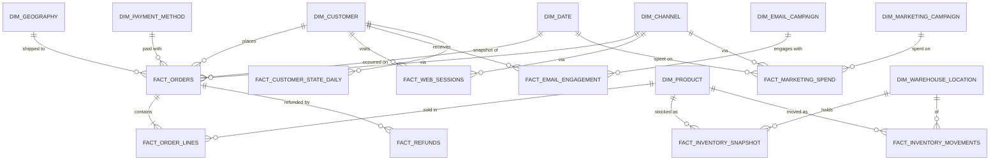

# Section 4 — Part 2: Canonical Data Model — Facts

> **Document status:** Draft v1
> **Audience:** Engineering team, technical clients, future contributors
> **Purpose:** Define every fact table in the canonical core layer at column level — grain, columns, source mapping, and special handling. Facts are where business events live and where the heavy data volume sits.

---

## 4.17 Scope and structure

This Part 2 defines the **facts** of the canonical core. Dimensions were covered in Part 1.

The pack ships with **9 fact tables** in v1, divided by load pattern:

| Fact | Pattern | Module | Approx. row volume (per year, mid-market client) |
|---|---|---|---|
| `fact_orders` | Transactional, incremental | Sales | 200K–5M |
| `fact_order_lines` | Transactional, incremental | Sales | 500K–15M |
| `fact_refunds` | Transactional, incremental | Sales | 10K–500K |
| `fact_marketing_spend` | Transactional, incremental | Customer 360 | 50K–500K |
| `fact_web_sessions` | Transactional, incremental | Customer 360 | 5M–100M |
| `fact_email_engagement` | Transactional, incremental | Customer 360 | 5M–50M |
| `fact_customer_state_daily` | **Snapshot**, daily | Customer 360 | (customers × 365) |
| `fact_inventory_snapshot` | **Snapshot**, daily | Inventory | (SKUs × locations × 365) |
| `fact_inventory_movements` | Transactional, incremental | Inventory | 100K–5M |

All facts live in the `CORE` schema of `ANALYTICS_RETAIL`. All facts are partitioned and clustered for query performance (see Section 4.27).

---

## 4.18 Fact conventions

These apply to every fact below. Stated once here.

### Three types of facts in this pack

1. **Transactional facts** — one row per business event (an order, a refund, a session). Append-only at the source; loaded incrementally; immutable once written.
2. **Snapshot facts** — one row per entity per time period (a customer's state on a given day, an SKU's inventory on a given day). Generated by us, not pulled from a source. Large by row count but small per row.
3. **Accumulating snapshots** — not used in v1. (E.g., tracking the lifecycle of a single order from placed → shipped → delivered → returned in one growing row. Useful for fulfillment analytics, deferred to v2.)

### Grain discipline

Every fact has exactly one explicit grain. The grain is stated at the top of every fact definition. **Mixing grain in a fact table is the single most common data warehouse mistake**, and the pack avoids it strictly: line items and order headers are separate facts, not one denormalized table.

### Foreign keys to dimensions

Facts join to dimensions via surrogate keys (`customer_sk`, `product_sk`, etc.), never via natural keys. This:

- Enforces SCD2 correctness (a fact joins to the version of the customer that existed at the time of the transaction)
- Allows dimensions to be rebuilt without touching facts
- Is faster to join (hash join on a single column)

The natural key (e.g., `customer_id`, `order_id`) is also stored as a degenerate column for direct querying when historical accuracy isn't needed.

### Currency

All currency amounts in facts are stored in the **client's reporting currency**, converted at the silver layer using daily FX rates. The original currency and amount are also retained as `original_currency_code` and `original_amount` for audit and reconciliation.

### Timestamps

All facts carry both the **business event timestamp** (when the event actually happened, in the event's local timezone) and the **load timestamp** (when we loaded it into the warehouse). Reporting uses the business timestamp; ops monitoring uses the load timestamp.

### Idempotent loads

All incremental facts use `unique_key` configuration in dbt so that re-running a load doesn't create duplicates. The unique key is always the natural transaction ID, never the surrogate.

### Audit and lineage columns (apply to every fact)

Every fact in the canonical core carries the same set of audit and lineage columns defined in Part 1, Section 4.2:

| Column | Type | Purpose |
|---|---|---|
| `_source_system` | VARCHAR | Origin source |
| `_source_record_id` | VARCHAR | Original ID in source |
| `_extracted_at` | TIMESTAMP_TZ | When extracted from source |
| `_loaded_at` | TIMESTAMP_TZ | When loaded into bronze |
| `_dbt_invocation_id` | VARCHAR | Producing dbt run |
| `_dbt_model` | VARCHAR | Producing dbt model |
| `_record_hash` | VARCHAR | SHA-256 of business columns for change detection |
| `_is_deleted_at_source` | BOOLEAN | Soft-delete flag |

These are populated automatically by the `add_audit_columns` macro and **are not repeated in each fact's column list below**. Assume every fact has them.

Full lineage and audit strategy is detailed in Section 4.31.

---

## 4.19 `fact_orders`

### Overview

One row per completed order at the header level. This is the most queried fact in the warehouse — it powers nearly every Sales Analytics report and feeds into Customer 360.

### Metadata

| Property | Value |
|---|---|
| Grain | One row per order |
| Pattern | Transactional, incremental |
| Source | Shopify (`orders`) + Stripe (`charges`) for payment confirmation |
| Natural key | `order_id` |
| Unique key (for dbt incremental) | `order_id` |
| Refresh cadence | Hourly incremental in production; daily in v1 |
| Used by | Sales, Customer 360, Inventory |
| Partition | `order_date` |
| Cluster | `customer_sk`, `channel_sk` |

### Columns

| # | Column | Type | Nullable | Description |
|---|---|---|---|---|
| 1 | `order_sk` | VARCHAR | No | Surrogate primary key |
| 2 | `order_id` | VARCHAR | No | Natural key from source — Shopify order ID |
| 3 | `order_number` | VARCHAR | No | Human-readable order number (e.g., "#1042") |
| 4 | `customer_sk` | VARCHAR | No | FK to `dim_customer` |
| 5 | `customer_id` | VARCHAR | No | Degenerate customer ID for direct query |
| 6 | `channel_sk` | VARCHAR | No | FK to `dim_channel` |
| 7 | `geography_sk` | VARCHAR | Yes | FK to `dim_geography` — shipping geography |
| 8 | `payment_method_sk` | VARCHAR | Yes | FK to `dim_payment_method` (primary payment method if multiple) |
| 9 | `order_date` | DATE | No | Business date of the order (used for partitioning) |
| 10 | `order_timestamp` | TIMESTAMP_TZ | No | Precise order timestamp |
| 11 | `order_status` | VARCHAR | No | `pending`, `paid`, `fulfilled`, `cancelled`, `refunded`, `partial_refund` |
| 12 | `fulfillment_status` | VARCHAR | Yes | `unfulfilled`, `partial`, `fulfilled`, `restocked` |
| 13 | `financial_status` | VARCHAR | No | `pending`, `authorized`, `paid`, `partially_paid`, `refunded`, `partially_refunded`, `voided` |
| 14 | `gross_amount` | NUMBER(18,4) | No | Order value before discounts and refunds |
| 15 | `discount_amount` | NUMBER(18,4) | No | Total discounts applied |
| 16 | `tax_amount` | NUMBER(18,4) | No | Total tax |
| 17 | `shipping_amount` | NUMBER(18,4) | No | Shipping charges |
| 18 | `tip_amount` | NUMBER(18,4) | No | Tips (where applicable) |
| 19 | `net_amount` | NUMBER(18,4) | No | Final amount paid (gross - discount + tax + shipping + tip) |
| 20 | `refunded_amount` | NUMBER(18,4) | No | Total refunded against this order (updated on refund events) |
| 21 | `net_after_refunds` | NUMBER(18,4) | No | `net_amount - refunded_amount` |
| 22 | `currency_code` | VARCHAR | No | Reporting currency (canonical) |
| 23 | `original_currency_code` | VARCHAR | No | Currency the customer transacted in |
| 24 | `original_gross_amount` | NUMBER(18,4) | No | Pre-conversion gross amount |
| 25 | `fx_rate_to_reporting` | NUMBER(18,8) | No | FX rate applied |
| 26 | `line_item_count` | NUMBER | No | Number of line items in this order |
| 27 | `total_quantity` | NUMBER | No | Total units across all line items |
| 28 | `is_first_order` | BOOLEAN | No | TRUE if this is the customer's first order |
| 29 | `is_repeat_order` | BOOLEAN | No | TRUE if customer had a prior order |
| 30 | `is_subscription_order` | BOOLEAN | No | TRUE for recurring/subscription orders |
| 31 | `is_test_order` | BOOLEAN | No | TRUE if flagged as test in source — filtered out by default |
| 32 | `discount_codes` | ARRAY | Yes | Array of discount codes applied |
| 33 | `primary_discount_code` | VARCHAR | Yes | Top-level discount code (first in array) — for filter convenience |
| 34 | `tags` | ARRAY | Yes | Order tags from source |
| 35 | `note` | VARCHAR | Yes | Order note (internal staff notes) |
| 36 | `utm_source` | VARCHAR | Yes | UTM source captured at checkout |
| 37 | `utm_medium` | VARCHAR | Yes | UTM medium |
| 38 | `utm_campaign` | VARCHAR | Yes | UTM campaign — joins to `dim_marketing_campaign.utm_campaign` |
| 39 | `utm_content` | VARCHAR | Yes | UTM content |
| 40 | `utm_term` | VARCHAR | Yes | UTM term |
| 41 | `referrer_url` | VARCHAR | Yes | Referrer URL captured at checkout |
| 42 | `landing_page_url` | VARCHAR | Yes | First page of the session that led to this order |
| 43 | `cart_id` | VARCHAR | Yes | Cart/checkout identifier — for funnel analysis joining to abandoned cart events |
| 44 | `customer_email_hash_at_order` | VARCHAR | No | Hashed email used for this specific order (may differ from current customer email) |
| 45 | `ip_address_hash` | VARCHAR | Yes | SHA-256 hash of IP — for fraud and geo analytics without storing raw IP |
| 46 | `device_category` | VARCHAR | Yes | Device used: `desktop`, `mobile`, `tablet` |
| 47 | `browser` | VARCHAR | Yes | Browser at checkout |
| 48 | `created_at` | TIMESTAMP_TZ | No | When the order was created in the source |
| 49 | `updated_at` | TIMESTAMP_TZ | No | Last update in the source |
| 50 | `loaded_at` | TIMESTAMP_TZ | No | When this row was loaded into the warehouse |

### Source mapping

| Canonical column | Shopify field | Stripe field | Notes |
|---|---|---|---|
| `order_id` | `id` | n/a | Shopify is source of truth |
| `customer_sk` | derived via `dim_customer.customer_id` lookup | | At order's `created_at` to honor SCD2 |
| `gross_amount` | `subtotal_price` | | Before tax and shipping |
| `tax_amount` | `total_tax` | | |
| `net_amount` | `total_price` | `amount_received` | Cross-check Stripe; flag if delta > 0.5% |
| `payment_method_sk` | `payment_gateway_names[0]` mapped via dim | `payment_method_details.type` | Stripe wins for accuracy |
| `is_test_order` | `test` field OR `tags` contains "test" | | |

### Special handling

- **Multi-currency:** Conversion happens at the silver layer using `fact_fx_rates_daily` (an internal helper fact, not a public table). The FX rate used is the rate for `order_date` in the order's currency to the client's reporting currency.
- **Refund updates:** When a refund occurs, `refunded_amount` and `net_after_refunds` are updated on the original order row (not appended). This is the one exception to fact immutability and is implemented via a dbt `merge` strategy.
- **Cancelled orders:** Cancelled orders are retained in the fact (not deleted) but marked with `order_status = 'cancelled'`. Most reports filter to non-cancelled.

### Open-source vs. Pro

- ✅ Open source: full fact, all columns, all source mapping
- 💼 Proprietary: nothing specific (this is foundational)

---

## 4.20 `fact_order_lines`

### Overview

One row per line item per order. This is where SKU-level revenue, quantity, and discount analytics live. Significantly higher row volume than `fact_orders` — typically 2.5–3× the order count.

### Metadata

| Property | Value |
|---|---|
| Grain | One row per line item per order |
| Pattern | Transactional, incremental |
| Source | Shopify (`order_line_items`) |
| Natural key | `order_id` + `line_item_id` |
| Unique key | `line_item_id` |
| Refresh cadence | Hourly incremental in production; daily in v1 |
| Used by | Sales, Customer 360, Inventory |
| Partition | `order_date` |
| Cluster | `product_sk`, `order_sk` |

### Columns

| # | Column | Type | Nullable | Description |
|---|---|---|---|---|
| 1 | `line_item_sk` | VARCHAR | No | Surrogate PK |
| 2 | `line_item_id` | VARCHAR | No | Natural key |
| 3 | `order_sk` | VARCHAR | No | FK to `fact_orders` |
| 4 | `order_id` | VARCHAR | No | Degenerate order ID |
| 5 | `customer_sk` | VARCHAR | No | FK to `dim_customer` — denormalized from order for query simplicity |
| 6 | `product_sk` | VARCHAR | No | FK to `dim_product` |
| 7 | `sku` | VARCHAR | No | Degenerate SKU |
| 8 | `product_title_at_sale` | VARCHAR | No | Product title at the moment of sale — preserves human-readable history even if product is renamed |
| 9 | `channel_sk` | VARCHAR | No | FK to `dim_channel` — denormalized from order |
| 10 | `order_date` | DATE | No | Business date (partitioned) |
| 11 | `quantity` | NUMBER(18,2) | No | Units ordered |
| 12 | `unit_price` | NUMBER(18,4) | No | Price per unit at time of sale |
| 13 | `unit_cost` | NUMBER(18,4) | Yes | Unit cost at time of sale (if cost tracked) |
| 14 | `line_subtotal` | NUMBER(18,4) | No | `quantity * unit_price` before discounts |
| 15 | `line_discount` | NUMBER(18,4) | No | Discounts allocated to this line |
| 16 | `line_tax` | NUMBER(18,4) | No | Tax allocated to this line |
| 17 | `line_net_amount` | NUMBER(18,4) | No | `line_subtotal - line_discount` (excluding tax) |
| 18 | `line_gross_margin` | NUMBER(18,4) | Yes | `line_net_amount - (quantity * unit_cost)` — null if cost not tracked |
| 19 | `was_promotional` | BOOLEAN | No | TRUE if any discount was applied to this line |
| 20 | `refunded_quantity` | NUMBER(18,2) | No | Quantity refunded against this line |
| 21 | `refunded_amount` | NUMBER(18,4) | No | Amount refunded |
| 22 | `is_returned` | BOOLEAN | No | TRUE if any quantity has been returned |
| 23 | `discount_codes` | ARRAY | Yes | Codes applied to this line |
| 24 | `currency_code` | VARCHAR | No | Reporting currency |
| 25 | `created_at` | TIMESTAMP_TZ | No | When the line was created |
| 26 | `loaded_at` | TIMESTAMP_TZ | No | Load timestamp |

### Source mapping

| Canonical column | Shopify field | Notes |
|---|---|---|
| `line_item_id` | `id` | |
| `quantity` | `quantity` | |
| `unit_price` | `price` | |
| `line_discount` | `total_discount` | |
| `unit_cost` | join to `dim_product.unit_cost` at `order_date` | Pulled from product dimension, not source order |

### Special handling

- **Discount allocation:** Order-level discounts are allocated proportionally to lines by `line_subtotal` weight. The pack ships this logic in `int_orders_enriched.sql`.
- **Cost lookup:** `unit_cost` is looked up from `dim_product` at the SCD2 version effective on `order_date`. This means margin reporting correctly reflects historical costs.
- **Returned lines:** Returns update `refunded_quantity` and `refunded_amount` on the original line. Margin is recalculated on return.

### Open-source vs. Pro

- ✅ Open source: full fact
- 💼 Proprietary: `line_gross_margin` enrichment with allocated overhead (e.g., shipping cost share) — basic margin is OSS

---

## 4.21 `fact_refunds`

### Overview

One row per refund event. Refunds link back to original orders and lines, but exist as their own fact because:

- They have their own timing (refund date ≠ order date)
- They have reasons and processor metadata
- Analytics often look at refund trends independent of original sales

### Metadata

| Property | Value |
|---|---|
| Grain | One row per refund event |
| Pattern | Transactional, incremental |
| Source | Shopify (`refunds`), Stripe (`refunds`) |
| Natural key | `refund_id` |
| Unique key | `refund_id` |
| Used by | Sales |
| Partition | `refund_date` |
| Cluster | `order_sk` |

### Columns

| # | Column | Type | Nullable | Description |
|---|---|---|---|---|
| 1 | `refund_sk` | VARCHAR | No | Surrogate PK |
| 2 | `refund_id` | VARCHAR | No | Natural key |
| 3 | `order_sk` | VARCHAR | No | FK to `fact_orders` |
| 4 | `order_id` | VARCHAR | No | Degenerate order ID |
| 5 | `customer_sk` | VARCHAR | No | FK to `dim_customer` |
| 6 | `refund_date` | DATE | No | Date of refund |
| 7 | `refund_timestamp` | TIMESTAMP_TZ | No | Precise refund time |
| 8 | `refund_type` | VARCHAR | No | `full_refund`, `partial_refund`, `goodwill`, `chargeback` |
| 9 | `refund_reason` | VARCHAR | Yes | Customer-stated or staff-noted reason |
| 10 | `refund_category` | VARCHAR | Yes | Standardized: `damaged`, `wrong_item`, `not_as_described`, `customer_change_of_mind`, `quality_issue`, `late_delivery`, `other` |
| 11 | `refund_amount` | NUMBER(18,4) | No | Amount refunded |
| 12 | `refund_tax_amount` | NUMBER(18,4) | No | Tax portion of the refund |
| 13 | `refund_shipping_amount` | NUMBER(18,4) | No | Shipping portion |
| 14 | `restocking_fee` | NUMBER(18,4) | No | Fees retained |
| 15 | `currency_code` | VARCHAR | No | Reporting currency |
| 16 | `original_currency_code` | VARCHAR | No | |
| 17 | `original_refund_amount` | NUMBER(18,4) | No | |
| 18 | `processor` | VARCHAR | No | E.g., `stripe`, `paypal`, `shopify_payments` |
| 19 | `is_chargeback` | BOOLEAN | No | TRUE if originated as a chargeback |
| 20 | `processed_by` | VARCHAR | Yes | Staff member or system that processed |
| 21 | `note` | VARCHAR | Yes | Free text note |
| 22 | `created_at` | TIMESTAMP_TZ | No | |
| 23 | `loaded_at` | TIMESTAMP_TZ | No | |

### Refund categorization

`refund_reason` is freeform; `refund_category` is standardized via a regex-mapping seed file. This lets reports compare refund categories across clients consistently.

### Open-source vs. Pro

- ✅ Open source: full fact
- 💼 Proprietary: ML-based refund reason classification (v2)

---

## 4.22 `fact_marketing_spend`

### Overview

Daily marketing spend by campaign and channel. Joins to `dim_marketing_campaign` for campaign attributes. Used to compute CAC, ROAS, and overall marketing efficiency.

### Metadata

| Property | Value |
|---|---|
| Grain | One row per campaign per day |
| Pattern | Transactional, incremental |
| Source | Meta Ads (`daily_insights`) — v1 only |
| Natural key | `campaign_id` + `date_sk` |
| Unique key | `campaign_id` + `date_sk` |
| Used by | Customer 360 |
| Partition | `spend_date` |

### Columns

| # | Column | Type | Description |
|---|---|---|---|
| 1 | `spend_sk` | VARCHAR | Surrogate PK |
| 2 | `campaign_sk` | VARCHAR | FK to `dim_marketing_campaign` |
| 3 | `campaign_id` | VARCHAR | Degenerate |
| 4 | `channel_sk` | VARCHAR | FK to `dim_channel` |
| 5 | `geography_sk` | VARCHAR | FK to `dim_geography` (if geo-targeted) |
| 6 | `spend_date` | DATE | Date of spend |
| 7 | `date_sk` | NUMBER | FK to `dim_date` |
| 8 | `spend_amount` | NUMBER(18,4) | Amount spent |
| 9 | `currency_code` | VARCHAR | Reporting currency |
| 10 | `original_currency_code` | VARCHAR | |
| 11 | `original_spend_amount` | NUMBER(18,4) | |
| 12 | `impressions` | NUMBER | Ad impressions |
| 13 | `clicks` | NUMBER | Clicks |
| 14 | `conversions_reported_by_platform` | NUMBER | Platform-attributed conversions (Meta-reported) |
| 15 | `conversion_value_reported_by_platform` | NUMBER(18,4) | Platform-attributed revenue |
| 16 | `loaded_at` | TIMESTAMP_TZ | |

### Note on platform-reported conversions

Platforms like Meta report their own conversion counts and values. These are kept as `*_reported_by_platform` for reference, but **the pack's canonical attribution uses warehouse data, not platform claims**. Platform-reported numbers are typically 2–4× higher than reality due to attribution windows and double-counting.

True attribution is calculated in the Customer 360 mart by joining marketing spend to actual orders via UTM parameters captured in `fact_web_sessions`.

### Open-source vs. Pro

- ✅ Open source: full fact (Meta Ads only)
- 💼 Proprietary: additional platforms (Google Ads, TikTok Ads) added in v2

---

## 4.23 `fact_web_sessions`

### Overview

One row per web session from GA4. High row volume — typically the largest fact by row count. Provides web behavior, acquisition source, and the link between marketing spend and orders.

### Metadata

| Property | Value |
|---|---|
| Grain | One row per session |
| Pattern | Transactional, incremental |
| Source | Google Analytics 4 (`events` aggregated to sessions) |
| Natural key | `session_id` |
| Unique key | `session_id` |
| Used by | Customer 360 |
| Partition | `session_date` |
| Cluster | `customer_sk`, `channel_sk` |

### Columns

| # | Column | Type | Description |
|---|---|---|---|
| 1 | `session_sk` | VARCHAR | Surrogate PK |
| 2 | `session_id` | VARCHAR | GA4 session identifier |
| 3 | `user_pseudo_id` | VARCHAR | GA4 anonymous user ID |
| 4 | `customer_sk` | VARCHAR | FK to `dim_customer` (null for anonymous sessions) |
| 5 | `customer_id` | VARCHAR | Degenerate (null for anonymous) |
| 6 | `channel_sk` | VARCHAR | FK to `dim_channel` (acquisition channel) |
| 7 | `geography_sk` | VARCHAR | FK to `dim_geography` |
| 8 | `session_date` | DATE | Date of session start (partitioned) |
| 9 | `session_start_timestamp` | TIMESTAMP_TZ | When the session began |
| 10 | `session_duration_seconds` | NUMBER | Length of session |
| 11 | `page_views` | NUMBER | Pages viewed in session |
| 12 | `events_count` | NUMBER | Total GA4 events |
| 13 | `device_category` | VARCHAR | `desktop`, `mobile`, `tablet` |
| 14 | `device_brand` | VARCHAR | Apple, Samsung, etc. |
| 15 | `device_os` | VARCHAR | iOS, Android, Windows, etc. |
| 16 | `browser` | VARCHAR | Chrome, Safari, etc. |
| 17 | `traffic_source` | VARCHAR | Raw source (e.g., `google`, `facebook.com`, `(direct)`) |
| 18 | `traffic_medium` | VARCHAR | `organic`, `cpc`, `social`, `email`, `(none)` |
| 19 | `traffic_campaign` | VARCHAR | UTM campaign |
| 20 | `traffic_content` | VARCHAR | UTM content |
| 21 | `traffic_term` | VARCHAR | UTM term |
| 22 | `landing_page` | VARCHAR | First page of session |
| 23 | `exit_page` | VARCHAR | Last page of session |
| 24 | `has_purchase_event` | BOOLEAN | TRUE if a purchase occurred in this session |
| 25 | `transaction_revenue` | NUMBER(18,4) | Revenue attributed to this session (if purchase) |
| 26 | `is_new_user` | BOOLEAN | First-ever session for this `user_pseudo_id` |
| 27 | `loaded_at` | TIMESTAMP_TZ | |

### Customer attribution

Anonymous sessions stay anonymous (`customer_sk` is null). When a user later logs in or completes a purchase, the `user_pseudo_id` is back-filled to the customer in the silver layer. Historical sessions for that pseudo ID can then be retroactively attributed via the `int_session_customer_stitching` model — this runs nightly and is moderately expensive.

### Channel resolution

`traffic_source` + `traffic_medium` is mapped to `channel_sk` via the dim_channel seed file (see Part 1, Section 4.6). E.g., `(google, organic)` → `organic_search_google`.

### Open-source vs. Pro

- ✅ Open source: full fact
- 💼 Proprietary: session-stitching across devices using customer login events

---

## 4.24 `fact_email_engagement`

### Overview

One row per email engagement event (sent, delivered, opened, clicked, unsubscribed, bounced). Used to measure email program effectiveness and identify retention signals.

### Metadata

| Property | Value |
|---|---|
| Grain | One row per email event |
| Pattern | Transactional, incremental |
| Source | Klaviyo (`events`) |
| Natural key | `event_id` |
| Unique key | `event_id` |
| Used by | Customer 360 |
| Partition | `event_date` |
| Cluster | `customer_sk`, `email_campaign_sk` |

### Columns

| # | Column | Type | Description |
|---|---|---|---|
| 1 | `event_sk` | VARCHAR | Surrogate PK |
| 2 | `event_id` | VARCHAR | Klaviyo event ID |
| 3 | `customer_sk` | VARCHAR | FK to `dim_customer` |
| 4 | `email_campaign_sk` | VARCHAR | FK to `dim_email_campaign` |
| 5 | `event_type` | VARCHAR | `sent`, `delivered`, `opened`, `clicked`, `bounced`, `unsubscribed`, `marked_spam`, `converted` |
| 6 | `event_date` | DATE | Partitioned |
| 7 | `event_timestamp` | TIMESTAMP_TZ | Precise event time |
| 8 | `email_subject` | VARCHAR | Subject at time of send |
| 9 | `link_url` | VARCHAR | For click events: URL clicked |
| 10 | `bounce_type` | VARCHAR | For bounces: `hard`, `soft`, `block` |
| 11 | `bounce_reason` | VARCHAR | Bounce reason text |
| 12 | `device_type` | VARCHAR | For opens/clicks: device used |
| 13 | `loaded_at` | TIMESTAMP_TZ | |

### Open-source vs. Pro

- ✅ Open source: full fact
- 💼 Proprietary: email→order attribution model

---

## 4.25 `fact_customer_state_daily`

### Overview

**Snapshot fact.** One row per customer per day, capturing the customer's state at end-of-day. This is the workhorse of cohort analysis, retention measurement, and active-customer metrics.

Large by row count — for a client with 500,000 customers, this fact accumulates 182M+ rows per year. Partitioning and snapshot retention policies are critical.

### Metadata

| Property | Value |
|---|---|
| Grain | One row per customer per day |
| Pattern | **Snapshot**, daily |
| Source | Generated from `dim_customer`, `fact_orders`, `fact_email_engagement` |
| Natural key | `customer_id` + `snapshot_date` |
| Unique key | `customer_id` + `snapshot_date` |
| Used by | Customer 360 |
| Partition | `snapshot_date` |
| Cluster | `customer_sk` |
| Retention | **Default 24 months daily; configurable per client up to 84 months (7 years)**. Beyond retention horizon, aggregated to monthly snapshots in a separate archive table |

### Columns

| # | Column | Type | Description |
|---|---|---|---|
| 1 | `customer_state_sk` | VARCHAR | Surrogate PK |
| 2 | `customer_sk` | VARCHAR | FK to `dim_customer` at snapshot date |
| 3 | `customer_id` | VARCHAR | Degenerate |
| 4 | `snapshot_date` | DATE | Date of snapshot (partitioned) |
| 5 | `days_since_acquisition` | NUMBER | Days since first appearance |
| 6 | `days_since_first_order` | NUMBER | Days since first purchase (null if never purchased) |
| 7 | `days_since_last_order` | NUMBER | Days since most recent purchase |
| 8 | `lifetime_order_count` | NUMBER | Cumulative orders to date |
| 9 | `lifetime_revenue` | NUMBER(18,4) | Cumulative net revenue to date |
| 10 | `lifetime_quantity` | NUMBER(18,2) | Cumulative units to date |
| 11 | `trailing_30d_order_count` | NUMBER | Orders in last 30 days |
| 12 | `trailing_30d_revenue` | NUMBER(18,4) | Revenue in last 30 days |
| 13 | `trailing_90d_order_count` | NUMBER | Orders in last 90 days |
| 14 | `trailing_90d_revenue` | NUMBER(18,4) | Revenue in last 90 days |
| 15 | `is_active_30d` | BOOLEAN | TRUE if any purchase in last 30 days |
| 16 | `is_active_90d` | BOOLEAN | TRUE if any purchase in last 90 days |
| 17 | `is_new_30d` | BOOLEAN | TRUE if acquired in last 30 days |
| 18 | `is_repeat_customer` | BOOLEAN | TRUE if lifetime_order_count >= 2 |
| 19 | `customer_segment` | VARCHAR | Segment as of snapshot date |
| 20 | `rfm_recency_tier` | VARCHAR | Pro: 1–5 tier on recency |
| 21 | `rfm_frequency_tier` | VARCHAR | Pro: 1–5 tier on frequency |
| 22 | `rfm_monetary_tier` | VARCHAR | Pro: 1–5 tier on monetary |
| 23 | `email_engagement_30d` | NUMBER | Email events in last 30 days |
| 24 | `predicted_churn_probability` | NUMBER(5,4) | Pro: 0.0–1.0 |
| 25 | `predicted_ltv` | NUMBER(18,4) | Pro: forecasted LTV |

### Snapshot generation

Daily dbt job creates one row per active customer for that day. "Active" here means: any customer with any source-system activity in the trailing 24 months, or any customer with `marketing_consent = TRUE`. Customers who have been dormant > 24 months without consent are aged out.

### Open-source vs. Pro

- ✅ Open source: columns 1–18 (basic state tracking, active flags, segment)
- 💼 Proprietary: columns 19–25 (RFM tiers, churn prediction, LTV prediction)

---

## 4.26 `fact_inventory_snapshot`

### Overview

**Snapshot fact.** One row per SKU per location per day, capturing stock position. The foundation of all inventory analytics.

For a client with 10,000 SKUs across 3 locations: 30,000 rows per day = 11M rows per year. Manageable with partitioning.

### Metadata

| Property | Value |
|---|---|
| Grain | One row per SKU per location per day |
| Pattern | **Snapshot**, daily |
| Source | Shopify (`inventory_levels`) |
| Natural key | `product_id` + `location_id` + `snapshot_date` |
| Unique key | same |
| Used by | Inventory |
| Partition | `snapshot_date` |
| Cluster | `product_sk`, `location_sk` |
| Retention | **Default 24 months daily; configurable per client up to 84 months**. Beyond retention horizon, aggregated to weekly snapshots in archive |

### Columns

| # | Column | Type | Description |
|---|---|---|---|
| 1 | `inventory_snapshot_sk` | VARCHAR | Surrogate PK |
| 2 | `product_sk` | VARCHAR | FK to `dim_product` |
| 3 | `sku` | VARCHAR | Degenerate |
| 4 | `location_sk` | VARCHAR | FK to `dim_warehouse_location` |
| 5 | `location_id` | VARCHAR | Degenerate |
| 6 | `snapshot_date` | DATE | Partitioned |
| 7 | `quantity_on_hand` | NUMBER(18,2) | Physical stock |
| 8 | `quantity_committed` | NUMBER(18,2) | Reserved for unfulfilled orders |
| 9 | `quantity_available` | NUMBER(18,2) | `on_hand - committed` |
| 10 | `quantity_incoming` | NUMBER(18,2) | On order from suppliers |
| 11 | `unit_cost` | NUMBER(18,4) | Cost at snapshot (from `dim_product`) |
| 12 | `inventory_value` | NUMBER(18,4) | `quantity_on_hand * unit_cost` |
| 13 | `days_of_supply` | NUMBER(18,2) | `quantity_available / avg_daily_sales_rate_28d` |
| 14 | `is_out_of_stock` | BOOLEAN | TRUE if `quantity_available <= 0` |
| 15 | `is_low_stock` | BOOLEAN | Pro: TRUE if `days_of_supply < 14` (configurable) |
| 16 | `is_overstock` | BOOLEAN | Pro: TRUE if `days_of_supply > 90` (configurable) |
| 17 | `is_slow_mover` | BOOLEAN | Pro: TRUE if no sales in last 60 days |
| 18 | `loaded_at` | TIMESTAMP_TZ | |

### Open-source vs. Pro

- ✅ Open source: columns 1–14 (stock position, value, basic OOS flag)
- 💼 Proprietary: columns 15–17 (intelligent flagging — low stock, overstock, slow mover)

---

## 4.27 `fact_inventory_movements`

### Overview

One row per inventory event. Audit trail of stock changes — receipts, sales, adjustments, transfers between locations. Reconciles snapshot deltas.

### Metadata

| Property | Value |
|---|---|
| Grain | One row per inventory movement event |
| Pattern | Transactional, incremental |
| Source | Shopify (`inventory_adjustments`, derived from `orders` for sales) |
| Natural key | `movement_id` |
| Unique key | `movement_id` |
| Used by | Inventory |
| Partition | `movement_date` |
| Cluster | `product_sk`, `location_sk` |

### Columns

| # | Column | Type | Description |
|---|---|---|---|
| 1 | `movement_sk` | VARCHAR | Surrogate PK |
| 2 | `movement_id` | VARCHAR | Natural key |
| 3 | `product_sk` | VARCHAR | FK |
| 4 | `sku` | VARCHAR | Degenerate |
| 5 | `location_sk` | VARCHAR | FK |
| 6 | `movement_date` | DATE | Partitioned |
| 7 | `movement_timestamp` | TIMESTAMP_TZ | Precise time |
| 8 | `movement_type` | VARCHAR | `receipt`, `sale`, `return`, `adjustment`, `transfer_in`, `transfer_out`, `damaged`, `lost` |
| 9 | `quantity_change` | NUMBER(18,2) | Signed: positive for inflow, negative for outflow |
| 10 | `unit_cost` | NUMBER(18,4) | Cost at time of movement |
| 11 | `movement_value` | NUMBER(18,4) | `abs(quantity_change) * unit_cost` |
| 12 | `reference_order_id` | VARCHAR | For sales/returns: source order |
| 13 | `reference_movement_id` | VARCHAR | For transfers: paired movement |
| 14 | `reason` | VARCHAR | Free-text reason |
| 15 | `note` | VARCHAR | Staff note |
| 16 | `created_by` | VARCHAR | Staff member or system |
| 17 | `loaded_at` | TIMESTAMP_TZ | |

### Open-source vs. Pro

- ✅ Open source: full fact

---

## 4.28 Partitioning and clustering strategy

A summary view of how each fact is physically organized in Snowflake for query performance:

| Fact | Partition (date column) | Cluster keys | Reason |
|---|---|---|---|
| `fact_orders` | `order_date` | `customer_sk`, `channel_sk` | Most queries filter by date and slice by customer or channel |
| `fact_order_lines` | `order_date` | `product_sk`, `order_sk` | Product-level analytics + order-level joins |
| `fact_refunds` | `refund_date` | `order_sk` | Often joined back to orders |
| `fact_marketing_spend` | `spend_date` | `campaign_sk` | Campaign-level queries |
| `fact_web_sessions` | `session_date` | `customer_sk`, `channel_sk` | High volume — clustering critical |
| `fact_email_engagement` | `event_date` | `customer_sk`, `email_campaign_sk` | High volume |
| `fact_customer_state_daily` | `snapshot_date` | `customer_sk` | Time-series queries per customer |
| `fact_inventory_snapshot` | `snapshot_date` | `product_sk`, `location_sk` | SKU-level inventory queries |
| `fact_inventory_movements` | `movement_date` | `product_sk`, `location_sk` | |

Snowflake doesn't have explicit partitions in the traditional sense — it uses micro-partitions managed automatically. The "partition column" here refers to the column used in `cluster by` and that filters define. This is documented in `dbt_project.yml`:

```yaml
models:
  spark_retail_pack:
    core:
      fact_orders:
        +cluster_by: ['order_date', 'customer_sk']
```

---

## 4.29 Fact-to-dimension relationship summary



---

## 4.30 Data volume sizing reference

For capacity planning, here is the expected daily and annual row volume for a mid-sized client (50K orders/year, 500K customers, 10K SKUs across 3 locations):

| Fact | Rows/day | Rows/year |
|---|---|---|
| `fact_orders` | ~140 | 50K |
| `fact_order_lines` | ~400 | 150K |
| `fact_refunds` | ~5 | 2K |
| `fact_marketing_spend` | ~50 | 18K |
| `fact_web_sessions` | ~20,000 | 7.3M |
| `fact_email_engagement` | ~30,000 | 11M |
| `fact_customer_state_daily` | ~500,000 | 180M+ |
| `fact_inventory_snapshot` | ~30,000 | 11M |
| `fact_inventory_movements` | ~600 | 220K |

Total annual rows for this profile: ~210M, well within Snowflake comfort. Storage cost (~50% compression): under $20/month on Snowflake standard tier.

---

## 4.31 Audit and lineage strategy

This section consolidates the audit and lineage approach across the entire pack. The eight audit columns introduced in Sections 4.2 and 4.18 are the foundation; this section describes how they are populated, queried, and surfaced operationally.

### Why audit columns matter

In any production data warehouse, three questions come up repeatedly:

1. **"Where did this number come from?"** — A KPI shows an unexpected value. A finance manager wants to trace it back through the warehouse to the source system that produced it.
2. **"When was this row produced and by which pipeline run?"** — A row looks wrong. An engineer needs to know if a specific dbt run caused it, so the run can be rolled back or replayed.
3. **"Has this data changed since I last looked?"** — Downstream consumers need to refresh only what has changed, not the entire warehouse.

Without audit columns these questions require manual investigation. With them, they become SQL queries.

### How each column is populated

| Column | Populated by | Mechanism |
|---|---|---|
| `_source_system` | Hardcoded per staging model | Each `stg_<source>__*.sql` sets `'shopify'`, `'stripe'`, etc. literal |
| `_source_record_id` | Extracted from source | The source's own ID (e.g., Shopify `id` field) |
| `_extracted_at` | Ingestion tool | Fivetran/Airbyte writes this to bronze; passed through unchanged |
| `_loaded_at` | dbt | Set by `current_timestamp()` at load time in staging |
| `_dbt_invocation_id` | dbt | `{{ invocation_id }}` Jinja variable |
| `_dbt_model` | dbt | `{{ this.name }}` Jinja variable |
| `_record_hash` | dbt | `MD5(CONCAT_WS('|', col1, col2, ...))` over business columns |
| `_is_deleted_at_source` | Source-specific logic | Mapped from source's soft-delete flag, or FALSE if source doesn't support |

### The `add_audit_columns` macro

A single dbt macro is called at the end of every staging, intermediate, core, and mart model:

```sql

    '{{ source_system }}' AS _source_system,
    {{ source_id_column }} AS _source_record_id,
    _extracted_at,
    current_timestamp() AS _loaded_at,
    '{{ invocation_id }}' AS _dbt_invocation_id,
    '{{ this.name }}' AS _dbt_model,
    {{ dbt_utils.generate_surrogate_key(business_columns) }} AS _record_hash,
    COALESCE(_is_deleted_at_source, FALSE) AS _is_deleted_at_source

```

Each model invokes this with its source identifier and business column list. The macro guarantees consistency — no model has to remember to add audit columns manually.

### Lineage via dbt's native graph

Beyond row-level audit columns, model-level lineage is captured by dbt itself:

- Every model declares its sources (`ref()` and `source()` macros)
- `dbt docs generate` produces a navigable lineage graph (HTML site)
- The lineage graph shows: bronze → silver → gold → marts → semantic layer
- Clients receive this docs site as part of every implementation — it's how analysts learn the model

For programmatic access, the dbt manifest (`manifest.json`) exposes the full DAG. The pack includes a helper macro that exports lineage to a flat table for clients who want to query it from SQL:

```sql
select * from analytics_retail.metadata.lineage_edges
where downstream_model = 'mart_customer.customer_lifetime_metrics';
```

### Run-level audit table

In addition to row-level audit columns, the pack writes a per-run audit record to `analytics_retail.metadata.dbt_run_log`:

| Column | Description |
|---|---|
| `invocation_id` | dbt invocation ID |
| `started_at` | Run start |
| `ended_at` | Run end |
| `status` | `success`, `error`, `partial` |
| `models_executed` | Count of models |
| `models_succeeded` | Count succeeded |
| `models_failed` | Count failed |
| `rows_inserted` | Total rows inserted across all models |
| `rows_updated` | Total rows updated |
| `triggered_by` | User or schedule that triggered the run |
| `target` | dbt target (dev, staging, prod) |
| `git_sha` | Git commit SHA at time of run (for reproducibility) |

This table is the operational source of truth for "what happened in the warehouse last night."

### Querying lineage at the business level

Common audit queries clients run:

**"Show me every row in `fact_orders` that came from the run yesterday morning":**

```sql
select *
from analytics_retail.core.fact_orders
where _dbt_invocation_id = (
    select invocation_id 
    from analytics_retail.metadata.dbt_run_log
    where started_at::date = current_date - 1
      and target = 'prod'
);
```

**"How long is the lag between data being extracted from Shopify and landing in our reports?"**

```sql
select 
    date_trunc('day', _loaded_at) as load_day,
    avg(datediff('minute', _extracted_at, _loaded_at)) as avg_lag_minutes,
    max(datediff('minute', _extracted_at, _loaded_at)) as max_lag_minutes
from analytics_retail.core.fact_orders
where _source_system = 'shopify'
  and _loaded_at >= current_date - 30
group by 1
order by 1;
```

**"Find orders where the source record was deleted but we still have the row":**

```sql
select * from analytics_retail.core.fact_orders
where _is_deleted_at_source = TRUE;
```

### Storage and performance considerations

Eight metadata columns per row sounds heavy but is cheap in practice:

- Snowflake's columnar storage compresses highly repetitive columns (`_source_system`, `_dbt_model`) to near-zero overhead
- `_record_hash` is the only column with high cardinality; ~32 bytes per row × 200M rows = ~6.4 GB uncompressed, ~1–2 GB compressed
- Query cost is unchanged unless audit columns are explicitly selected

The trade-off is heavily in favor of having the columns.

### Open-source vs. Pro

- ✅ Open source: the `add_audit_columns` macro, all audit columns on every model, the lineage helper macros
- ✅ Open source: the `dbt_run_log` table and population logic
- 💼 Proprietary: a Power BI "Data Operations" dashboard that visualizes the run log, lineage, freshness SLAs, and audit anomalies

This decision is recorded in [ADR-002: Audit and Lineage Architecture](../07_decisions/ADR-002-audit-and-lineage.md).

---

## 4.32 Summary

Nine fact tables, three patterns (transactional, snapshot, accumulating-deferred-to-v2), all joining cleanly to the nine dimensions defined in Part 1. Plus a comprehensive audit and lineage strategy applied to every table.

Key design choices:

- **Strict grain discipline** — line items and order headers are separate facts
- **All FKs are surrogate keys** to honor SCD2; natural keys are kept as degenerate columns
- **Reporting currency conversion happens once, at silver** — facts never deal with FX
- **Snapshots are first-class** — `fact_customer_state_daily` and `fact_inventory_snapshot` are the basis of nearly all time-series analytics
- **8 audit/lineage columns on every table** — populated by a single macro; provides source traceability, run-level rollback, change detection, and freshness monitoring (ADR-002)
- **Tiered identity resolution with confidence flagging** — email → phone → fuzzy name+address, with override mechanism for client control (ADR-003)
- **Configurable snapshot retention** — 24 months by default; clients can extend up to 7 years for deep cohort analysis
- **UTM tracking propagated to `fact_orders`** — eliminates session-join dependency for marketing attribution
- **Roughly 70% of fact code is open source**, with the proprietary additions concentrated on enrichment (RFM tiers, churn prediction, intelligent inventory flagging)

The next section (Section 5: KPI Catalog) defines every metric that gets computed on top of these facts — formulas, grain, ownership, and module assignment.

---

**Previous:** [Section 4 — Part 1: Canonical Data Model — Dimensions](./04_canonical_data_model_part1_dimensions.md)
**Next:** [Section 4 — Part 3: Implementation Standards and Best Practices](./04_canonical_data_model_part3_implementation_standards.md)
